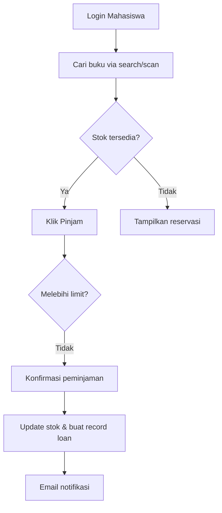
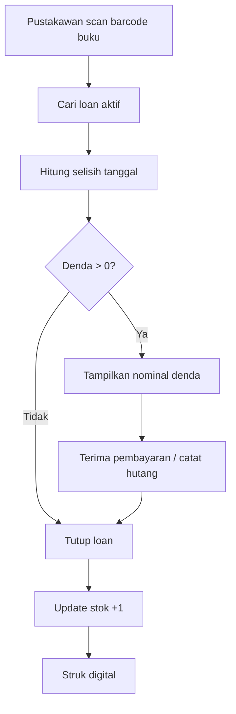

Berikut adalah **Product Requirements Document (PRD)** untuk **Web App Perpustakaan Kampus** dengan skala proyek nyata (real project). PRD ini dirancang agar dapat langsung digunakan oleh tim produk, desainer, dan engineer untuk mengembangkan sistem perpustakaan digital yang modern, efisien, dan scalable.

---

# PRODUCT REQUIREMENTS DOCUMENT (PRD)
## Aplikasi Web Manajemen Perpustakaan Kampus (SmartLib)

| **Doc Version** | 1.0 |
| --- | --- |
| **Status** | Draft |
| **Date** | 21 April 2026 |
| **Product Owner** | [Nama PM] |
| **Target Launch** | MVP: 3 bulan | Fase 2: +2 bulan |

---

## 1. Pendahuluan

### 1.1 Latar Belakang
Perpustakaan kampus saat ini masih banyak menggunakan sistem manual atau semi-digital (Excel, catatan fisik), sehingga terjadi masalah seperti:
- Antrean panjang saat peminjaman/pengembalian.
- Buku hilang atau telat dikembalikan tanpa deteksi dini.
- Mahasiswa kesulitan mencari koleksi secara real-time.
- Laporan akuntabilitas aset perpustakaan tidak akurat.

### 1.2 Tujuan Produk
- Meningkatkan efisiensi operasional perpustakaan hingga **70%**.
- Memberikan pengalaman self-service bagi pemustaka.
- Menyediakan data real-time ketersediaan buku dan histori peminjaman.
- Mengurangi risiko kehilangan koleksi dengan sistem denda otomatis dan notifikasi.

### 1.3 Target Pengguna (Persona)

| Role | Deskripsi | Pain Points |
| --- | --- | --- |
| **Mahasiswa** | Pengguna utama, usia 18-25, mobile-first | Ingin cek buku cepat, perpanjang online, tahu denda |
| **Dosen** | Meminjam buku riset, perlu histori panjang | Butuh akses jurnal dan buku referensi langka |
| **Pustakawan** | Mengelola koleksi, sirkulasi, laporan | Beban kerja manual tinggi, butuh dashboard terintegrasi |
| **Admin Sistem** | Manage user, role, backup data, logs | Keamanan, audit trail, performa server |

---

## 2. Lingkup Fungsional (Epics & User Stories)

### Epic 1: Manajemen Koleksi (Pustakawan & Admin)
| ID | User Story | Acceptance Criteria |
| --- | --- | --- |
| COL-01 | Sebagai pustakawan, saya ingin menambah buku baru dengan barcode/ISBN otomatis | - Scan ISBN auto-fill metadata (Google Books API) <br>- Generate barcode unik <br>- Upload cover image |
| COL-02 | Saya ingin mengedit status buku (rusak, hilang, dipinjam, tersedia) | - Status berubah di seluruh sistem <br>- Log perubahan tersimpan |
| COL-03 | Saya ingin menghapus buku (soft delete) | - Buku tidak muncul di pencarian <br>- Data histori tetap ada |

### Epic 2: Pencarian & Penelusuran (Semua Role)
| ID | User Story | Acceptance Criteria |
| --- | --- | --- |
| SEA-01 | Sebagai mahasiswa, saya ingin mencari buku berdasarkan judul, penulis, ISBN, atau kata kunci | - Hasil muncul < 2 detik <br>- Filter: subjek, tahun terbit, lokasi rak <br>- Pagination & sorting relevansi |
| SEA-02 | Saya ingin melihat detail buku: sinopsis, jumlah eksemplar, eksemplar tersedia | - Tampilkan stok real-time <br>- Peta lokasi rak (virtual map sederhana) |

### Epic 3: Peminjaman & Pengembalian (Self-Service & Pustakawan)
| ID | User Story | Acceptance Criteria |
| --- | --- | --- |
| LOAN-01 | Sebagai mahasiswa, saya ingin meminjam buku secara mandiri via scan QR/barcode di web (dengan login) | - Cek status peminjam (tidak ada denda overdue > 3 buku) <br>- Kurangi stok eksemplar <br>- Kirim email notifikasi jatuh tempo |
| LOAN-02 | Sebagai pustakawan, saya ingin memproses pengembalian dan hitung denda otomatis | - Scan barcode buku -> otomatis tutup peminjaman <br>- Hitung denda (Rp 1000/hari) <br>- Generate struk digital |
| LOAN-03 | Sebagai mahasiswa, saya ingin perpanjang peminjaman online (max 2x) | - Cek apakah buku direservasi user lain <br>- Perpanjang +7 hari <br>- Update due date |

### Epic 4: Reservasi & Antrian (Booking)
| ID | User Story | Acceptance Criteria |
| --- | --- | --- |
| RES-01 | Sebagai mahasiswa, saya ingin mereservasi buku yang sedang dipinjam | - Masuk waiting list <br>- Notifikasi via email saat buku tersedia <br>- Batas ambil 2x24 jam |
| RES-02 | Sebagai pustakawan, saya melihat daftar reservasi aktif | - Urut berdasarkan waktu reservasi <br>- Tombol "serahkan ke pemesan" |

### Epic 5: Dashboard & Laporan (Pustakawan & Admin)
| ID | User Story | Acceptance Criteria |
| --- | --- | --- |
| REP-01 | Sebagai pustakawan, saya ingin melihat dashboard: total peminjaman hari ini, buku populer, denda terkumpul | - Real-time chart (Chart.js / ApexCharts) <br>- Filter tanggal |
| REP-02 | Saya ingin export laporan (Excel/PDF) untuk peminjaman, denda, inventaris | - Pilih rentang tanggal <br>- Download dengan format standar |

### Epic 6: Manajemen Pengguna & Role (Admin)
| ID | User Story | Acceptance Criteria |
| --- | --- | --- |
| USR-01 | Sebagai admin, saya ingin mengaktifkan/non-aktifkan akun mahasiswa | - Blokir peminjaman jika non-aktif <br>- Log aktivitas |
| USR-02 | Saya ingin melihat histori lengkap peminjaman per user | - Tampilkan denda belum dibayar <br>- Filter berdasarkan status |

### Epic 7: Notifikasi (Otomatis)
| ID | Trigger | Channel |
| --- | --- | --- |
| NOT-01 | H-1 jatuh tempo | Email + Web Push (opsional) |
| NOT-02 | Buku reservasi tersedia | Email |
| NOT-03 | Denda baru terakumulasi | Email (weekly recap) |

---

## 3. Spesifikasi Non-Fungsional

### 3.1 Performa & Skalabilitas
| Parameter | Target |
| --- | --- |
| Waktu muat halaman awal | < 2 detik (3G kecepatan sedang) |
| Concurrent user | Support 1000+ user simultan (misal saat UTS) |
| Query pencarian | < 500 ms untuk 1 juta data buku |
| Uptime | 99.5% (maintenance malam Minggu) |

### 3.2 Keamanan
- **Autentikasi**: JWT dengan refresh token, session timeout 30 menit.
- **RBAC (Role Based Access Control)**: 4 role (Mahasiswa, Dosen, Pustakawan, Admin).
- **Data sensitif**: Password di-hash (bcrypt), log aktivitas user disimpan 1 tahun.
- **Anti SQL Injection & XSS**: Menggunakan ORM (Prisma/TypeORM) dan sanitasi input.

### 3.3 Platform & Teknologi (Rekomendasi)
| Layer | Pilihan |
| --- | --- |
| Frontend | Next.js 14 (App Router) + Tailwind CSS + Shadcn/ui |
| Backend | Node.js (NestJS) atau Go (Fiber) untuk performa tinggi |
| Database | PostgreSQL (data utama) + Redis (cache pencarian & session) |
| Storage | AWS S3 / MinIO (cover buku, laporan) |
| Queue | BullMQ (untuk email async, export laporan berat) |
| Deployment | Docker + Kubernetes (scaling otomatis) atau VPS (awal) |

### 3.4 Aksesibilitas
- Memenuhi standar **WCAG 2.1 Level AA** (kontras, keyboard navigation, alt text).
- Tersedia mode dark/light.

---

## 4. Alur Pengguna Kunci (Flow Diagram)

### 4.1 Peminjaman Buku oleh Mahasiswa


### 4.2 Pengembalian dengan Denda


---

## 5. Data Model (Entity Relationship Core)

```sql
-- Contoh tabel utama
Users (
  id UUID PK,
  role ENUM('student','lecturer','librarian','admin'),
  email UNIQUE,
  password_hash,
  full_name,
  student_id (UNIQUE),
  is_active BOOLEAN,
  created_at
)

Books (
  id UUID PK,
  title, author, isbn UNIQUE,
  publisher, year, description,
  cover_url,
  total_copies, available_copies
)

BookCopies (
  id UUID PK,
  book_id FK,
  barcode UNIQUE,
  status ('available','borrowed','damaged','lost'),
  rack_location
)

Loans (
  id UUID PK,
  user_id FK,
  copy_id FK,
  loan_date,
  due_date,
  return_date,
  fine_amount,
  status ('active','returned','overdue')
)

Reservations (
  id UUID PK,
  user_id FK,
  book_id FK,
  reserved_at,
  expiry_at,
  status ('waiting','ready','cancelled','taken')
)
```

---

## 6. Prioritas & Roadmap (MVP vs Phase 2)

### MVP (3 bulan) – Wajib rilis
| Fitur | Note |
| --- | --- |
| Login dengan role dasar (mahasiswa & pustakawan) | Hanya email & password |
| Manajemen buku (CRUD sederhana) | Tanpa auto-isbn, manual input |
| Pencarian buku (judul/penulis) | Tanpa filter kompleks |
| Peminjaman & pengembalian (via pustakawan) | Mahasiswa belum bisa self-service |
| Denda otomatis | Hitung, tetapi pembayaran offline |
| Dashboard dasar (jumlah peminjaman) | Tanpa chart realtime |

### Phase 2 (bulan 4-5)
- Self-service peminjaman via scan QR.
- Reservasi online & waiting list.
- Export laporan Excel/PDF.
- Notifikasi email.
- Integrasi dengan sistem pembayaran (midtrans/xendit) untuk denda.
- Mobile Responsive perfect.

### Phase 3 (post-launch improvement)
- Single Sign On (SSO) dengan kampus.
- Rekomendasi buku berbasis AI.
- E-book reader integration.
- Chatbot (FAQ perpustakaan).

---

## 7. Metrik Keberhasilan (KPI)

| Metrik | Baseline | Target (3 bulan) | Pengukuran |
| --- | --- | --- | --- |
| Rata-rata waktu peminjaman (end-to-end) | 5 menit (manual) | < 45 detik | Aplikasi logging |
| Persentase buku telat kembali | 30% | < 10% | Laporan bulanan |
| Jumlah transaksi tanpa pustakawan | 0% | 60% (self-service) | DB record |
| Skor SUS (System Usability Scale) | - | > 75 | Survei setelah 2 bulan |

---

## 8. Risiko & Mitigasi

| Risiko | Dampak | Mitigasi |
| --- | --- | --- |
| Server down saat jam sibuk (UTS) | Tinggi | Auto-scaling K8s + load testing sebelum rilis |
| Mahasiswa lupa password | Sedang | Fitur reset password via email kampus |
| Barcode scanner tidak kompatibel | Sedang | Support manual input ISBN sebagai fallback |
| Data hilang karena error migrasi | Tinggi | Backup otomatis database tiap 6 jam + WAL archiving |

---

## 9. Tampilan Antarmuka (Wireframe Deskripsi)

> *Untuk mockup visual, tim desain akan membuat di Figma, namun berikut ringkasan layout kunci:*

### Halaman Login
- Form email + password.
- Tombol "Login dengan NIM" (SSO nanti).
- Link lupa password.

### Dashboard Mahasiswa
- Kartu "Peminjaman Aktif" + jumlah denda.
- Search bar menonjol di tengah.
- Daftar buku rekomendasi (berdasarkan histori).

### Dashboard Pustakawan
- Tabel antrean pengembalian hari ini.
- Tombol "Scan Barcode" besar.
- Grafik sederhana peminjaman per jam.

### Halaman Detail Buku
- Cover, metadata, stok tersedia.
- Tombol "Pinjam" (jika stok ada) atau "Reservasi".
- Peta lokasi rak (grid sederhana: lantai 2, rak A3).

---

## 10. Lampiran & Referensi

- **API Eksternal**: Google Books API (untuk auto-fill metadata), Email service (Resend / SendGrid).
- **Regulasi**: Wajib mematuhi UU Hak Cipta (tidak menyediakan fulltext ilegal) dan UU PDP (perlindungan data pribadi).
- **Dokumen pendukung**: User flow diagram lengkap (Figma Jam), ERD detail (dbdiagram.io), dan Technical Specification Document terpisah.

---

**Disusun oleh:** Product Team  
**Review berikutnya:** [Tanggal] dengan stakeholder perpustakaan kampus.

--- 
