# Tutorial Selenium
> **Catatan:** Tutorial ini merupakan terjemahan dan elaborasi dari dokumen asli Selenium Tutorial ke dalam Bahasa Indonesia, ditujukan untuk mahasiswa yang mempelajari Software Quality Assurance.

---

## Daftar Isi

1. [Pendahuluan](#pendahuluan)
2. [Komponen Selenium](#komponen-selenium)
3. [Fitur Utama Selenium](#fitur-utama-selenium)
4. [Contoh Script Test Selenium WebDriver](#contoh-script-test)
5. [Selenium - Tinjauan Umum](#selenium---tinjauan-umum)
6. [Selenium - Pengujian Otomatis](#selenium---pengujian-otomatis)
7. [Selenium - Pengaturan Lingkungan](#selenium---pengaturan-lingkungan)
8. [Selenium Remote Control (RC)](#selenium-remote-control-rc)
9. [Selenium IDE - Pengenalan](#selenium-ide---pengenalan)
10. [Selenium IDE - Fitur-fitur](#selenium-ide---fitur-fitur)
11. [Selenium IDE - Keterbatasan](#selenium-ide---keterbatasan)
12. [Selenium IDE - Instalasi](#selenium-ide---instalasi)
13. [Selenium IDE - Membuat Test](#selenium-ide---membuat-test)
14. [Selenium IDE - Membuat Script](#selenium-ide---membuat-script)
15. [Selenium IDE - Control Flow](#selenium-ide---control-flow)
16. [Selenium IDE - Store Variables](#selenium-ide---store-variables)
17. [Selenium IDE - Alerts & Popups](#selenium-ide---alerts--popups)
18. [Selenium IDE - Perintah Selenese](#selenium-ide---perintah-selenese)
19. [Selenium IDE - Perintah Actions](#selenium-ide---perintah-actions)
20. [Selenium IDE - Perintah Accessors](#selenium-ide---perintah-accessors)
21. [Selenium IDE - Perintah Assertions](#selenium-ide---perintah-assertions)
22. [Selenium IDE - Metode Assert/Verify](#selenium-ide---metode-assertverify)
23. [Selenium IDE - Strategi Pencarian Elemen](#selenium-ide---strategi-pencarian-elemen)
24. [Selenium IDE - Debugging Script](#selenium-ide---debugging-script)
25. [Selenium IDE - Titik Verifikasi](#selenium-ide---titik-verifikasi)
26. [Selenium IDE - Pattern Matching](#selenium-ide---pattern-matching)
27. [Selenium IDE - File JSON](#selenium-ide---file-json)
28. [Selenium IDE - Eksekusi di Berbagai Browser](#selenium-ide---eksekusi-di-berbagai-browser)
29. [Selenium - User Extensions](#selenium---user-extensions)
30. [Selenium IDE - Ekspor Kode](#selenium-ide---ekspor-kode)
31. [Selenium IDE - Emitting Code](#selenium-ide---emitting-code)
32. [Selenium IDE - Fungsi JavaScript](#selenium-ide---fungsi-javascript)
33. [Selenium IDE - Plugins](#selenium-ide---plugins)
34. [Selenium WebDriver - Pengenalan](#selenium-webdriver---pengenalan)
35. [Selenium WebDriver vs RC](#selenium-webdriver-vs-rc)

---

## Pendahuluan

Selenium adalah framework pengujian otomasi open-source yang banyak digunakan, dirancang untuk membantu pengguna menguji aplikasi web di berbagai browser dan platform. Selenium bukan hanya satu alat, tetapi merupakan sekumpulan alat yang membantu para tester mengotomatisasi pengujian aplikasi berbasis web secara lebih efisien. Tutorial komprehensif ini akan membantu Anda mendapatkan pemahaman mendalam tentang Selenium dan cara menggunakannya untuk menyederhanakan proses pengujian.

> **Elaborasi:** Selenium dikembangkan pertama kali oleh Jason Huggins pada tahun 2004 sebagai alat internal di ThoughtWorks. Kini, Selenium telah menjadi standar industri untuk otomasi pengujian web karena sifatnya yang open-source, dukungan komunitas yang besar, dan kemampuannya bekerja dengan berbagai bahasa pemrograman dan browser.

---

## Komponen Selenium

Dalam tutorial ini, Anda akan menemukan deskripsi detail tentang empat alat berikut yang membentuk suite Selenium:

- **Selenium IDE** − Selenium Integrated Development Environment (IDE) adalah plugin untuk Firefox dan Chrome yang memungkinkan tester merekam tindakan mereka saat mengikuti alur kerja yang perlu diuji. Selenium IDE memungkinkan pengguna membuat skrip test tanpa harus menulis kode secara manual. Meskipun menawarkan kemudahan awal, Selenium IDE biasanya tidak direkomendasikan untuk menguji skenario yang kompleks.

- **Selenium RC** − Selenium Remote Control (RC) adalah framework pengujian unggulan yang memungkinkan lebih dari sekedar aksi browser sederhana dan eksekusi linear. RC dapat membantu Anda menggunakan kekuatan penuh bahasa pemrograman seperti Java, C#, PHP, Python, Ruby, dan PERL untuk membuat tes yang lebih kompleks.

- **Selenium WebDriver** − Selenium WebDriver adalah penerus Selenium RC yang mengirim perintah langsung ke browser dan mengambil hasil, sehingga lebih cepat dari Selenium RC. WebDriver dirancang untuk mengotomatisasi interaksi browser. WebDriver menyediakan API sederhana untuk mengontrol browser dan membantu pengguna berinteraksi dengan elemen web.

- **Selenium Grid** − Selenium Grid digunakan untuk menjalankan tes secara paralel di banyak mesin. Berkat distribusi eksekusi tes di berbagai lingkungan, dapat sangat meminimalkan waktu pengujian.

---

## Fitur Utama Selenium

Berikut adalah beberapa fitur utama Selenium yang membuatnya sangat populer di kalangan tester dan developer:

- **Kompatibilitas Lintas Browser** − Anda dapat menggunakan Selenium untuk menjalankan tes di berbagai browser termasuk Chrome, Firefox, Safari, dan Internet Explorer. Ini memastikan aplikasi web Anda bekerja secara konsisten di semua platform browser.

- **Independensi Platform** − Selenium tidak terikat pada sistem operasi tertentu. Selenium dapat berjalan di Windows, macOS, dan Linux. Karena independensi platform ini, Selenium menjadi pilihan utama untuk pengujian di berbagai platform.

- **Dukungan untuk Berbagai Bahasa Pemrograman** − Selenium mendukung berbagai bahasa pemrograman termasuk Java, Python, C#, Ruby, dan JavaScript. Fleksibilitas ini memungkinkan tester dan developer memilih bahasa yang paling mereka kuasai.

- **Extensibility (Kemampuan Perluasan)** − Selenium memiliki fitur yang memungkinkan pengguna untuk mengintegrasikan fungsionalitas tambahan melalui berbagai plugin atau ekstensi. Selenium dapat dengan mudah dikustomisasi untuk memenuhi kebutuhan pengujian spesifik.

---

## Contoh Script Test

Memulai dengan Selenium melibatkan pengaturan lingkungan pengembangan, memilih bahasa pemrograman yang paling sesuai dengan keahlian Anda, dan mengonfigurasi Selenium WebDriver.

Berikut adalah contoh kasus uji yang ditulis dalam Python menggunakan Selenium WebDriver, di mana kita akan membuka browser web (Chrome), menavigasi ke sebuah situs web, mendapatkan judulnya dan mencetaknya di konsol:

**Persyaratan:** Sebelum memulai, pastikan Anda telah menginstal Python di sistem Anda beserta library Selenium WebDriver.

```python
from selenium import webdriver

def first_test_script():
    # Membuat instance Chrome WebDriver
    # Anda juga bisa menggunakan browser lain
    driver = webdriver.Chrome()

    # Navigasi ke website
    driver.get("https://www.tutorialspoint.com")

    # Mendapatkan judul halaman
    title = driver.title

    # Mencetak judul website
    print("Title: " + title)

    # Menutup jendela browser
    driver.quit()

if __name__ == "__main__":
    first_test_script()
```

Simpan skrip ke file (misalnya, `selenium_example.py`) dan jalankan menggunakan:

```bash
python selenium_example.py
```

**Output yang dihasilkan:**
```
Title: Online Tutorials, Courses, and eBooks Library | Tutorialspoint
```

---

## Selenium - Tinjauan Umum

### Pengenalan

Selenium adalah alat pengujian perangkat lunak otomatis yang open-source dan portabel untuk menguji aplikasi web. Selenium memiliki kemampuan untuk beroperasi di berbagai browser dan sistem operasi. Selenium bukan hanya satu alat tunggal, tetapi merupakan paket alat yang melayani kebutuhan pengujian yang berbeda.

### Keunggulan Selenium

QTP (Quick Test Professional) dan Selenium adalah alat yang paling banyak digunakan di pasar untuk pengujian otomasi perangkat lunak. Berikut adalah beberapa keunggulan Selenium dibandingkan QTP:

| Keunggulan Selenium | Keterangan |
|---|---|
| Open Source | Gratis tanpa biaya lisensi |
| Multi-bahasa | Mendukung Java, Python, C#, Ruby, JavaScript |
| Multi-browser | Chrome, Firefox, Safari, IE, Edge |
| Multi-platform | Windows, Mac, Linux, Android |
| Komunitas besar | Banyak dukungan forum dan dokumentasi |

### Kelemahan Selenium

| Kelemahan | Keterangan |
|---|---|
| Hanya web | Tidak mendukung aplikasi desktop |
| Butuh pemrograman | Memerlukan pengetahuan teknis |
| Tidak ada object repository | Manajemen elemen lebih sulit |
| Tidak ada laporan bawaan | Perlu integrasi dengan alat lain |
| Tidak support CAPTCHA/QR | Terbatas pada interaksi web standar |

---

## Selenium - Pengujian Otomatis

Selenium terutama digunakan untuk mengotomatisasi tes pada aplikasi web. Selenium gratis dan tidak memerlukan biaya lisensi. Pengujian otomatis dengan Selenium jauh lebih disukai daripada pengujian manual karena pengujian otomatis jauh lebih efisien.

### Jenis-Jenis Tes Selenium

Selenium dapat digunakan untuk membuat berbagai jenis tes:

- **Functional Tests (Tes Fungsional)** − Tes ini membantu memeriksa berbagai fungsi dan fitur baru dari aplikasi atau produk yang sedang diuji.

- **Regression Tests (Tes Regresi)** − Tes ini membantu memeriksa apakah perubahan kode telah merusak fungsi yang sudah ada dari aplikasi.

- **Smoke Tests (Tes Asap)** − Tes ini membantu memverifikasi apakah build baru cukup stabil untuk melanjutkan aktivitas pengujian.

- **Integration Tests (Tes Integrasi)** − Tes ini membantu memvalidasi apakah integrasi semua modul berfungsi bersama sebagai satu unit.

- **Unit Tests (Tes Unit)** − Tes ini dibuat oleh para developer untuk menguji kode mereka.

### Alat Pengujian Otomasi Selenium

Selenium terdiri dari sekelompok alat yang sering disebut komponen Selenium:

- **Selenium IDE** − Tersedia sebagai addon untuk browser Chrome dan Firefox.
- **Selenium Remote Control** − Server yang dikembangkan dalam Java dan memungkinkan penulisan tes otomasi dalam berbagai bahasa seperti Java, Perl, Python, dll.
- **Selenium Webdriver** − Alat yang dapat diintegrasikan dengan framework lain seperti TestNG, JUnit, dll.
- **Selenium Grid** − Alat yang membantu mencapai eksekusi paralel di berbagai platform dan browser.

### Perbedaan Selenium 3.x dan 4.x

Versi terbaru Selenium adalah versi 4. Dari versi Selenium 4, seluruh arsitektur sepenuhnya kompatibel dengan W3C - World Wide Consortium. Perbedaan dasar antara Selenium 3.x dan Selenium 4.x:

- Di Selenium 3, komunikasi antara klien dan server dilakukan melalui protokol JSON Wire, namun mulai dari Selenium 4, ada komunikasi langsung antara klien dan server berdasarkan standar W3C.
- Selenium 4 juga memberikan beberapa locator tambahan (selain locator biasa seperti id, class, xpath) yang disebut Relative locators dengan metode: `above`, `below`, `near`, `toRight`, `toLeft`.

Arsitektur Selenium WebDriver versi 4.0:

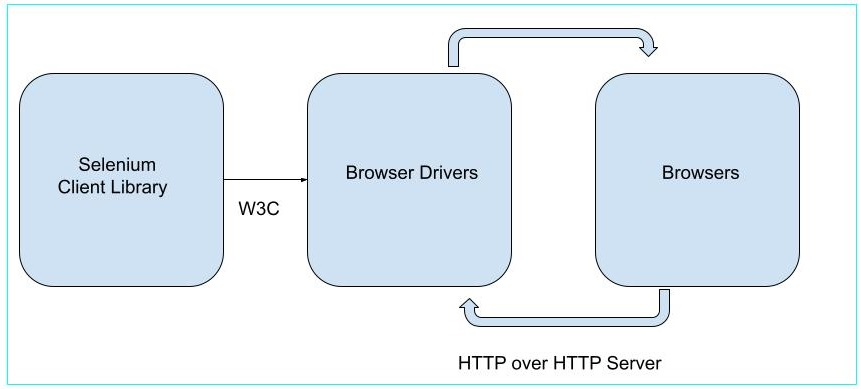

---

## Selenium - Pengaturan Lingkungan

Selenium WebDriver dapat digunakan untuk mengotomatisasi tes pada aplikasi web. Selenium dapat digunakan dengan berbagai bahasa seperti Java, Python, Ruby, dll.

### Setup Selenium dengan Java

Instalasi Selenium dapat dicapai dengan langkah-langkah berikut:

#### Langkah 1 - Instal Java

Unduh dan instal Java di sistem lokal Anda dari tautan berikut:
- https://www.oracle.com/java

Setelah berhasil menginstal Java, konfirmasi instalasinya dengan menjalankan perintah berikut:

```
C:\java
```

Konfirmasi versi Java yang terinstal:

```bash
java version
```

Output yang diharapkan:
```
openjdk version "17.0.9" 2023-10-17
OpenJDK Runtime Environment Homebrew (build 17.0.9+0)
OpenJDK 64-Bit Server VM Homebrew (build 17.0.9+0, mixed mode, sharing)
```

Instal juga Maven dari:
- https://maven.apache.org/download.cgi

Konfirmasi versi Maven:
```bash
mvn version
```

Output:
```
Apache Maven 3.9.6
Maven home: /opt/homebrew/Cellar/maven/3.9.6/libexec
Java version: 21.0.1
```

#### Langkah 2 - Instal IntelliJ IDE

Instal editor IntelliJ untuk menjalankan tes Selenium.

**Langkah 1** − Navigasi ke website resmi IntelliJ (produk JetBrains):
https://www.jetbrains.com/idea/


**Langkah 2** − Pilih versi IntelliJ yang ingin diunduh (tersedia untuk berbagai sistem operasi).

IntelliJ hadir dalam dua versi: Berbayar dan Community (gratis).

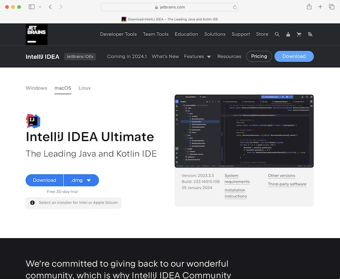

Unduh versi Community dan navigasi ke bagian IntelliJ IDEA Community Edition.

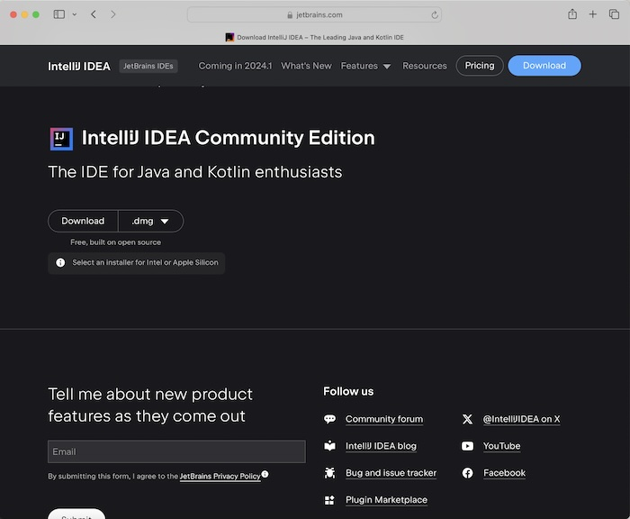

**Langkah 3** − Logo IntelliJ akan muncul beberapa detik, lalu JETBRAINS COMMUNITY EDITION TERMS akan muncul. Klik pada tombol Continue.

**Langkah 4** − Tampilan "Welcome to IntelliJ IDEA" muncul. Klik tombol New Project.

**Langkah 5** − Masukkan nama di bawah field Name. Pilih Language sebagai Java, Build System sebagai Maven, dan versi JDK, lalu klik Next.

**Langkah 6** − Masukkan ArtifactId dan klik Create.

**Langkah 7** − Setup editor IntelliJ selesai dengan sukses.

#### Langkah 8 - Tambahkan Dependensi Selenium Maven

Navigasi ke: https://mvnrepository.com

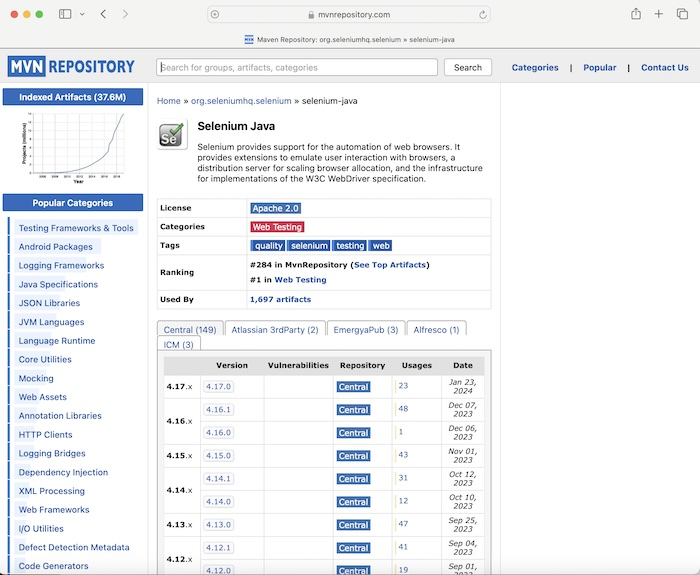

Pilih dan klik tautan versi di bawah tab Central. Navigasi ke halaman Selenium Java.

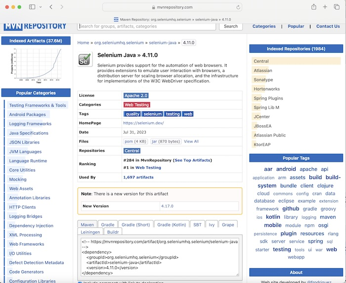

Contoh dependensi yang perlu ditambahkan:

```xml
<!-- https://mvnrepository.com/artifact/org.seleniumhq.selenium/selenium-java -->
<dependency>
    <groupId>org.seleniumhq.selenium</groupId>
    <artifactId>selenium-java</artifactId>
    <version>4.11.0</version>
</dependency>
```

#### Langkah 9 - Implementasi Kode

Tambahkan kode berikut di file `Main.java`:

```java
package org.example;

import org.openqa.selenium.WebDriver;
import org.openqa.selenium.chrome.ChromeDriver;
import java.util.concurrent.TimeUnit;

public class Main {
    public static void main(String[] args) throws InterruptedException {
        // Inisiasi WebDriver
        WebDriver driver = new ChromeDriver();

        // Menambahkan implicit wait 15 detik
        driver.manage().timeouts().implicitlyWait(15, TimeUnit.SECONDS);

        // Membuka URL
        driver.get("https://www.google.com");

        // Mendapatkan judul browser setelah dibuka
        System.out.println("Browser title: " + driver.getTitle());
    }
}
```

Dependensi lengkap di file `pom.xml`:

```xml
<?xml version="1.0" encoding="UTF-8"?>
<project xmlns="http://maven.apache.org/POM/4.0.0"
    xmlns:xsi="http://www.w3.org/2001/XMLSchema-instance"
    xsi:schemaLocation="http://maven.apache.org/POM/4.0.0
    http://maven.apache.org/xsd/maven-4.0.0.xsd">
    <modelVersion>4.0.0</modelVersion>
    <groupId>org.example</groupId>
    <artifactId>SeleniumJava</artifactId>
    <version>1.0-SNAPSHOT</version>
    <properties>
        <maven.compiler.source>16</maven.compiler.source>
        <maven.compiler.target>16</maven.compiler.target>
        <project.build.sourceEncoding>UTF-8</project.build.sourceEncoding>
    </properties>
    <dependencies>
        <dependency>
            <groupId>org.seleniumhq.selenium</groupId>
            <artifactId>selenium-java</artifactId>
            <version>4.11.0</version>
        </dependency>
    </dependencies>
</project>
```

**Output:**
```
Browser title: Google
Process finished with exit code 0
```

Browser Chrome akan terbuka dengan pesan: *"Chrome is being controlled by automated test software"*

### Contoh Tambahan - Launch dan Quit Browser

```java
package org.example;

import org.openqa.selenium.WebDriver;
import org.openqa.selenium.chrome.ChromeDriver;
import java.util.concurrent.TimeUnit;

public class MainBrowserQuit {
    public static void main(String[] args) throws InterruptedException {
        // Inisiasi WebDriver
        WebDriver driver = new ChromeDriver();

        // Implicit wait 15 detik
        driver.manage().timeouts().implicitlyWait(15, TimeUnit.SECONDS);

        // Membuka URL dan mendapatkan judul
        driver.get("https://www.tutorialspoint.com/selenium/practice/selenium_automation_practice.php");
        System.out.println("Browser title after launch: " + driver.getTitle());

        // Menutup browser
        driver.quit();
    }
}
```

**Output:**
```
Browser title after launch: Selenium Practice - Student Registration Form
Process finished with exit code 0
```

---

## Selenium Remote Control (RC)

### Apa itu Selenium Remote Control?

Selenium Remote Control adalah bagian dari suite Selenium yang terdiri dari library klien dan server yang membuka dan menutup browser. Tes otomasi di Selenium Remote Control dapat dikembangkan dalam berbagai bahasa pemrograman seperti Java, Python, C#, dll.

Selenium Remote Control (RC) adalah proyek Selenium utama yang bertahan lama sebelum Selenium WebDriver (Selenium 2.0) mengambil alih. RC memungkinkan kita menulis tes UI web otomatis dengan bantuan kekuatan penuh bahasa pemrograman seperti Java, C#, Perl, Python, PHP, dan Ruby.

### Arsitektur Selenium Remote Control

Arsitektur Selenium Remote Control digambarkan dalam diagram berikut:

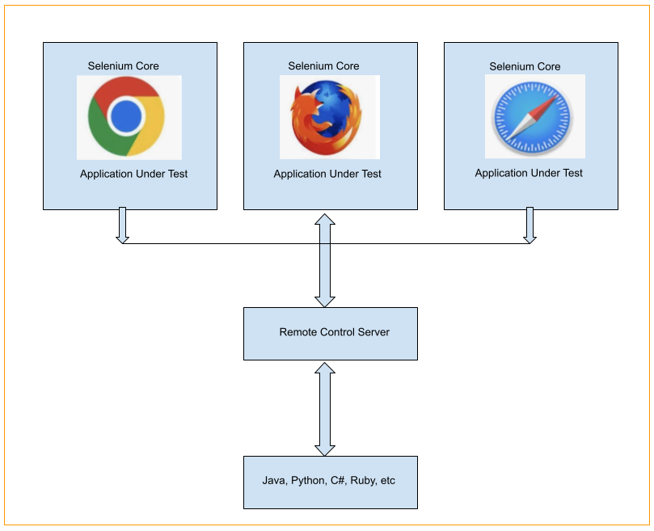

Arsitektur Selenium Remote Control tidak sederhana. Untuk memicu tes di Selenium Remote Control, kita perlu membuat instance dari Selenium RC Server.

**Selenium Server** bertindak sebagai prosesor pusat untuk seluruh aplikasi. Server menerima skrip untuk test case yang ditulis oleh pengguna dan mengirimkan perintah tersebut ke browser.

**Client libraries** adalah library khusus bahasa pemrograman yang digunakan oleh tester untuk membuat skrip tes.

### Keterbatasan Selenium Remote Control

Keterbatasan Selenium Remote Control disebabkan oleh arsitekturnya yang rumit. Selain itu, eksekusi tes memakan waktu lebih lama dibandingkan Selenium WebDriver.

### Instalasi Selenium RC dengan Java

**Prasyarat:**

**Langkah 1** − Unduh dan instal Java dari: https://www.oracle.com/java/technologies/downloads/

**Langkah 2** − Konfirmasi versi Java:
```bash
java version
```

**Langkah 3** − Unduh Selenium Java client dari: https://www.selenium.dev/downloads/

**Langkah 4** − Ekstrak file jar untuk selenium-java.

**Langkah 5** − Instal editor kode seperti IntelliJ atau Eclipse.

**Langkah 6** − Buat proyek java dalam editor.

**Langkah 7** − Tambahkan file selenium-java.jar ke classpath.

**Langkah 8** − Buat tes Selenium dalam Java.

**Langkah 9** − Unduh dan ekstrak file Java jar - `selenium-server-standalone.jar`.

**Langkah 10** − Jalankan perintah berikut dari command line:
```bash
java -jar selenium-server-standalone-<version-number>.jar
```

**Langkah 11** − Eksekusi tes Selenium yang telah dikembangkan.

---

## Selenium IDE - Pengenalan

Selenium-IDE (Integrated Development Environment) adalah plugin Firefox dan Chrome yang mudah digunakan untuk mengembangkan tes Selenium.

### Apa itu Selenium IDE?

Selenium Integrated Development Environment adalah alat yang sangat mudah dipelajari dan digunakan untuk menguji aplikasi web. Selenium IDE pada dasarnya menyediakan Antarmuka Grafis (GUI) yang memungkinkan pengguna merekam semua aksi yang dilakukan pada browser.

Selenium IDE juga dapat digunakan dengan sangat baik untuk tujuan debugging skrip dengan mengatur breakpoint.

Logika yang dibuat untuk test case tertentu dapat digunakan kembali di test case lain dengan bantuan perintah `run` di Selenium IDE.

### Manfaat Menggunakan Selenium IDE

- Selenium IDE juga memberikan fitur untuk menggunakan lebih dari satu locator untuk mengidentifikasi elemen.
- Karena kemudahan penggunaan, siapa pun dapat menggunakan Selenium IDE untuk mengembangkan tes otomatis.

### Cara Menggunakan Selenium IDE

Selenium IDE dapat digunakan dengan menginstal addon-nya yang tersedia dari toko Chrome dan Firefox. Untuk memulai instalasi Selenium IDE di Chrome dan Firefox, gunakan tautan berikut:
- https://www.selenium.dev/selenium-ide/

### Kapan Menggunakan Selenium IDE?

Selenium IDE sangat cocok digunakan oleh tester yang sedang menguji aplikasi web secara manual dan ingin mulai mengotomatisasi pengujian tersebut. Selenium IDE ideal untuk:
- Skenario pengujian sederhana
- Prototyping test script yang cepat
- Pengguna yang tidak memiliki latar belakang pemrograman mendalam

---

## Selenium IDE - Fitur-fitur

Selenium Integrated Development Environment adalah plugin yang tersedia untuk browser Chrome dan Firefox. Selenium IDE menyediakan Antarmuka Grafis yang memungkinkan pengguna merekam semua aksi yang dilakukan pada browser.

### Fitur Utama Selenium IDE

#### Record and Playback (Rekam dan Putar Ulang)
Selenium IDE memiliki fitur yang memungkinkan perekaman aksi pengguna yang dilakukan pada browser. Rekaman ini dapat diputar ulang kapan saja untuk melakukan pengujian.

#### Validasi
Tes Selenium IDE dapat digunakan lebih efektif dengan menambahkan berbagai perintah `assert` dan `verify` selama perekaman.

#### Perintah Selenese
Setiap perintah yang digunakan di Selenium IDE disebut perintah Selenese. Menggunakan perintah Selenese kita dapat melakukan semua aksi pada browser. Ada tiga kategori perintah:

- **Actions** − Perintah aksi digunakan untuk memanipulasi keadaan aplikasi yang sedang diuji. Contoh: `click`, `type`, `select`, dll.
- **Accessors** − Perintah accessor digunakan untuk menilai keadaan aplikasi dan menyimpannya dalam variabel. Contoh: `store`, `storeText`, `storeTitle`, dll.
- **Assertions** − Perintah assertion digunakan untuk memeriksa keadaan aplikasi. Memiliki tiga sub-tipe: `assert`, `verify`, dan `waitFor`.

#### Third Party Plugins
Banyak plugin pihak ketiga yang dapat diinstal dalam Selenium IDE untuk melakukan tindakan tambahan.

#### CI/CD Support
Tes Selenium IDE dapat dijalankan dari command line menggunakan Selenium Side Runner.

#### Cross Browser Testing
Tes Selenium IDE dapat dieksekusi di berbagai browser seperti Chrome, Firefox, Safari, Edge.

#### Responsiveness
Tes yang dirancang dengan Selenium IDE dapat dieksekusi di Visual Grid yang terdiri dari berbagai perangkat.

### Komponen-komponen Selenium IDE

#### Menu Bar

Menu Bar berisi nama proyek, opsi untuk membuat proyek baru atau membuka proyek yang sudah ada, menyimpan proyek, dll.

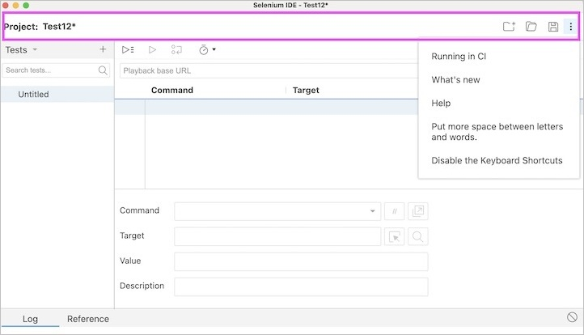

#### Tool Bar

Tool Bar terdiri dari opsi kecepatan eksekusi tes, tombol Step over, Run current test, Run all tests, Stop, Record, dll.

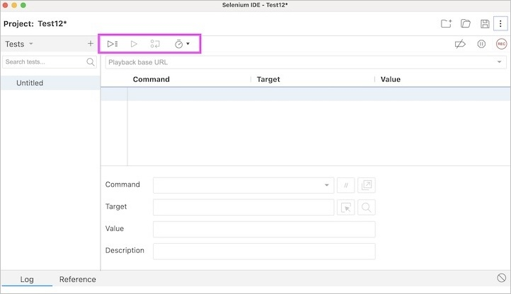

#### Address Bar

Address Bar memiliki menu dropdown yang menyimpan setiap nilai sebelumnya untuk base url.

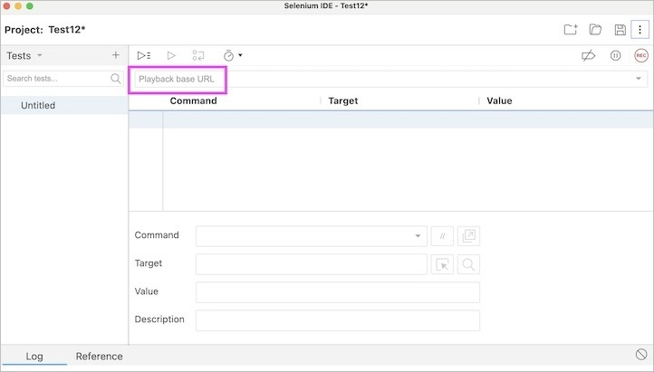

#### Test Case Pane

Test Case Pane berisi setiap tes yang telah direkam oleh Selenium IDE.

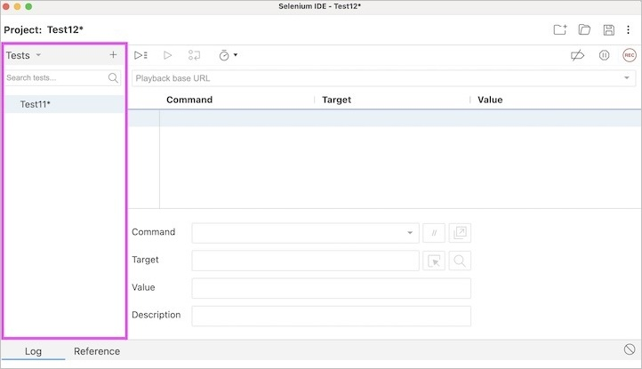

#### Test Script Editor Box

Test Script Editor Box berisi langkah-langkah tes aktual, aksi pengguna, validasi, dll baik yang direkam maupun yang dirancang secara manual.

Test Script Editor Box memiliki komponen Command (yang menangani aksi yang akan dilakukan pada web), Target (yang menangani locator elemen), dan Value (yang menangani nilai yang akan dimasukkan).

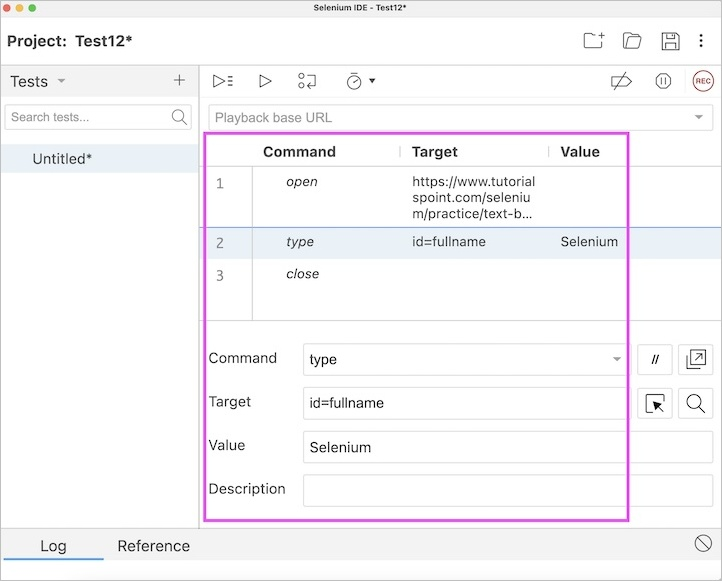

#### Recording Button

Tombol Recording digunakan untuk memulai dan menghentikan perekaman tes di Selenium IDE.

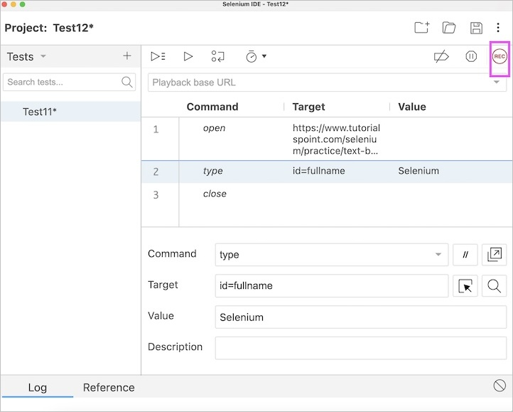

#### Log

Bagian Log menangkap pesan eksekusi, informasi, peringatan (jika ada), dan error.

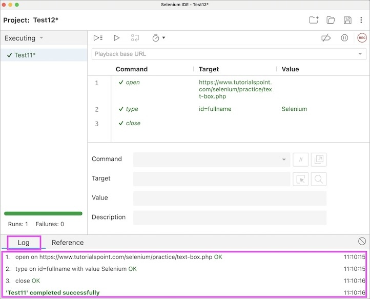

#### Reference

Bagian Reference menampilkan setiap informasi dari perintah yang saat ini dipilih dalam langkah tes.

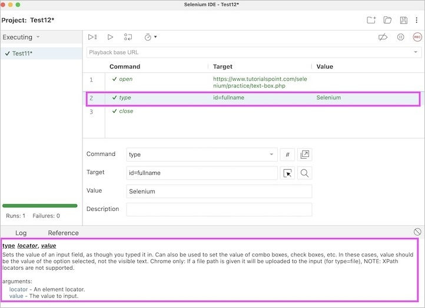

---

## Selenium IDE - Keterbatasan

Selenium IDE adalah alat yang mudah dan open source yang dapat digunakan secara ekstensif untuk otomasi. Namun, ada beberapa keterbatasan:

1. **Tidak cocok untuk aplikasi kompleks** − Selenium IDE bukan pilihan terbaik untuk menguji aplikasi kompleks yang membutuhkan interaksi berat dengan database.

2. **Tidak mendukung pengujian database** − Pengujian database tidak dapat dilakukan menggunakan Selenium IDE.

3. **Tidak bisa menangani elemen dinamis** − Selenium IDE tidak dapat bekerja dengan elemen dinamis yang berubah setiap kali halaman dimuat.

4. **Tidak bisa tangkap screenshot** − Pengambilan screenshot tidak dapat dilakukan menggunakan Selenium IDE.

5. **Tidak ada laporan default** − Pembuatan laporan default setelah eksekusi tes tidak dapat dilakukan.

6. **Hanya untuk Chrome dan Firefox** − Selenium IDE saat ini hanya tersedia untuk Chrome dan Firefox.

7. **Tidak mendukung iterasi** − Tes Selenium IDE tidak termasuk tes yang perlu dijalankan pada banyak iterasi dan kondisi berbeda.

8. **Tidak ada error handling** − Fitur penanganan error tidak tersedia dengan Selenium IDE.

9. **Tidak ada pengelompokan tes** − Pengelompokan pengujian berdasarkan fungsionalitas dan jenis tidak dapat dilakukan.

10. **Tidak untuk regression testing kompleks** − Regression testing tidak dapat dilakukan menggunakan Selenium IDE.

---

## Selenium IDE - Instalasi

Selenium IDE dapat diinstal sebagai ekstensi di Chrome dan Firefox.

### Instalasi Ekstensi Chrome untuk Selenium IDE

**Langkah 1** − Navigasi ke tautan berikut dan pilih tab CHROME DOWNLOAD:
https://www.selenium.dev/selenium-ide/

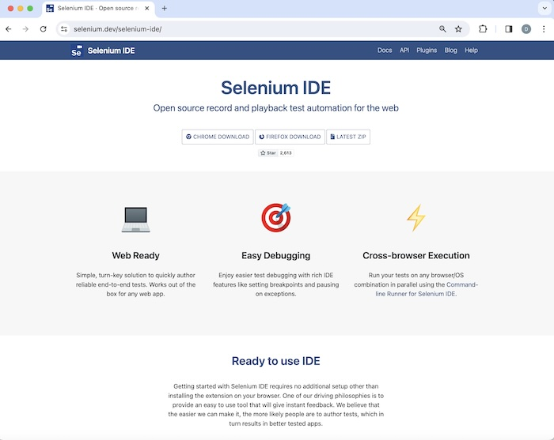

**Langkah 2** − Anda akan diarahkan ke Chrome Web Store, halaman Extensions untuk Selenium IDE.

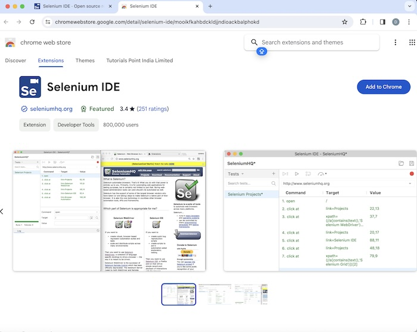

**Langkah 3** − Klik tombol Add extension pada popup.

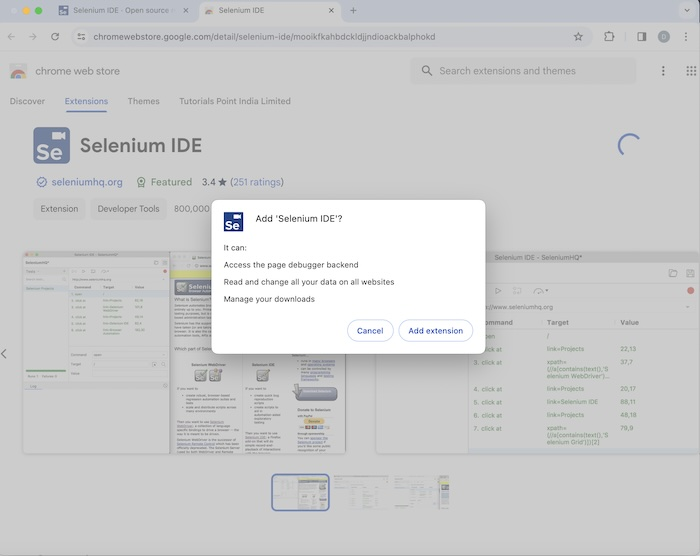

**Langkah 4** − Selenium IDE berhasil terinstal. Setelah itu kita akan dapat meluncurkannya.

**Langkah 5** − Disarankan untuk me-restart browser setelah Langkah 4. Kemudian Selenium IDE dapat diluncurkan dari plugin browser.

### Meluncurkan Selenium IDE di Chrome

Setelah Selenium IDE diluncurkan dari plugin Chrome, kita akan mendapatkan opsi untuk memilih apa yang ingin dilakukan seperti Record a new test in a new project, Open an existing project, Create a new project.

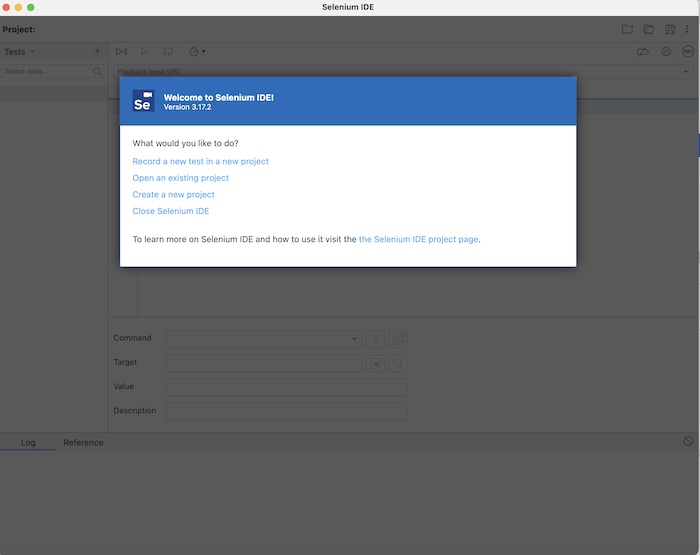

### Instalasi Ekstensi Firefox untuk Selenium IDE

**Langkah 1** − Navigasi ke tautan berikut dan pilih tab FIREFOX DOWNLOAD:
https://www.selenium.dev/selenium-ide/

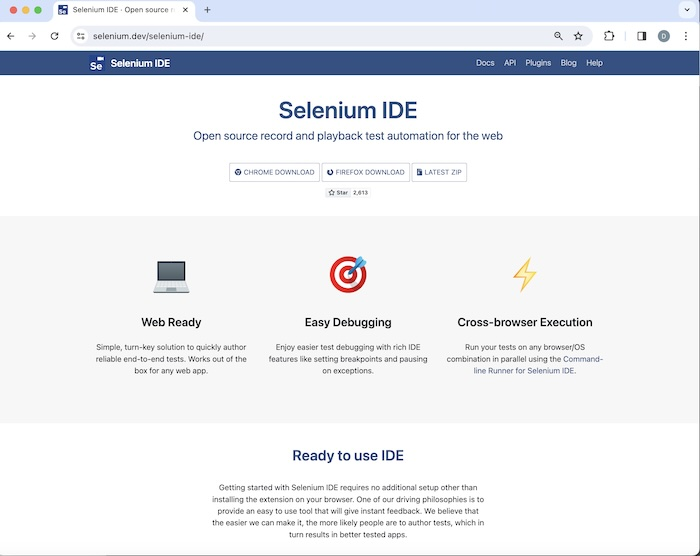

**Langkah 2** − Anda akan diarahkan ke Firefox Web Store, halaman Extensions untuk Selenium IDE.

**Langkah 3** − Jendela popup akan muncul. Klik tombol Add.

**Langkah 4** − Selenium IDE berhasil terinstal.

**Langkah 5** − Restart browser setelah Langkah 4.

### Meluncurkan Selenium IDE di Firefox

Setelah Selenium IDE diluncurkan dari plugin Firefox:

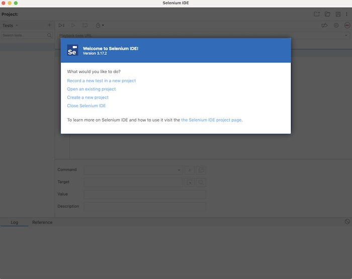

---

## Selenium IDE - Membuat Test

Selenium IDE dapat digunakan untuk membuat tes otomasi. Versi terbaru Selenium IDE tersedia sebagai ekstensi untuk browser Chrome dan Firefox.

### Langkah-langkah Membuat Test di Selenium IDE

**Langkah 1** − Klik pada ekstensi Selenium IDE yang terlihat di browser setelah instalasinya.

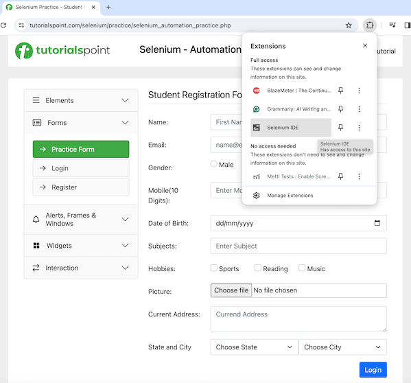

**Langkah 2** − Selenium IDE diluncurkan bersama pesan selamat datang dengan versi alat.

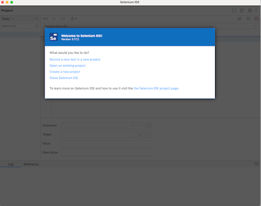

**Langkah 3** − Klik opsi "Record a new test in a new project". Kemudian masukkan PROJECT NAME.

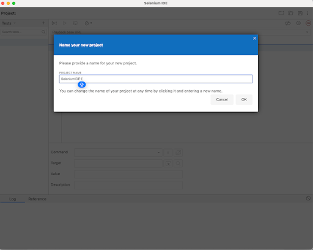

**Langkah 4** − Sebelum memulai dengan membuat tes di Selenium IDE, kita perlu menentukan Base URL aplikasi.

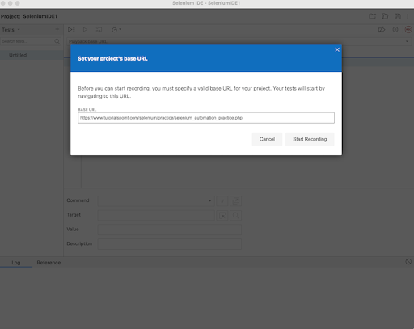

**Langkah 5** − Aplikasi yang Base URL-nya telah diberikan akan dibuka dengan logo Selenium IDE yang menunjukkan bahwa perekaman sedang berjalan.

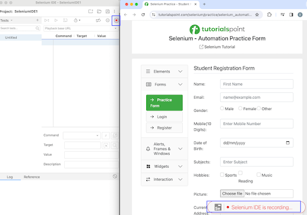

**Langkah 6** − Kita melakukan beberapa langkah pada aplikasi dan langkah-langkah yang sesuai akan direkam di Selenium IDE.

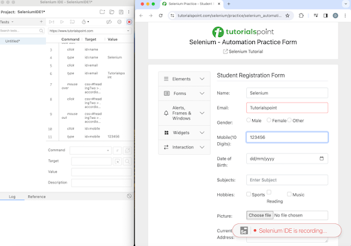

**Langkah 7** − Setelah semua tes selesai dilakukan, hentikan perekaman dengan mengklik ikon merah.

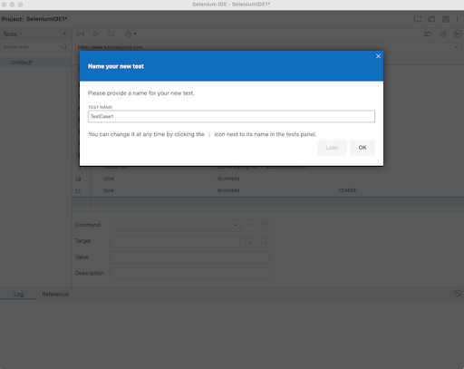

**Langkah 8** − Semua langkah yang dilakukan pada aplikasi akan direkam di Selenium IDE di bawah kolom Command, Target, dan Value.

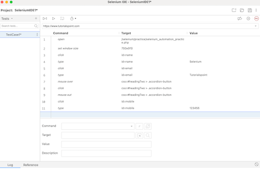

**Langkah 9** − Setelah tes dibuat, kita dapat melihat detail langkah tersebut dengan mengkliknya. Informasi tentang Command, Target, dan Value akan terisi.

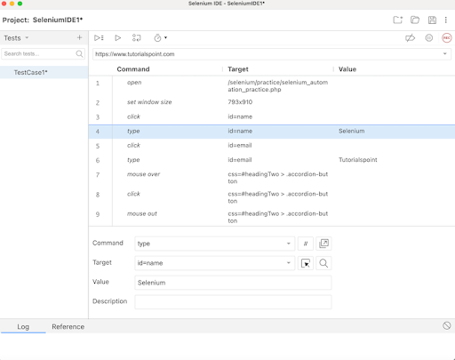

**Langkah 10** − Jika kita mengklik dropdown di field Target, kita dapat melihat berbagai strategi locator yang direkam oleh Selenium IDE.

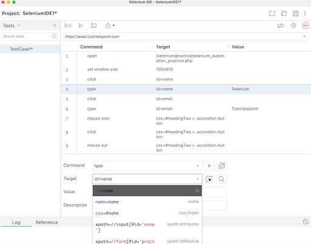

**Langkah 11** − Setelah mengklik salah satu langkah tes, kita mendapatkan detail perintah dan aksinya di Log.

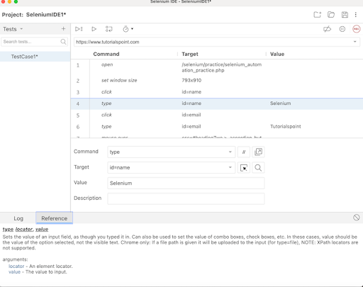

**Langkah 12** − Kita bisa klik kanan pada langkah manapun untuk mendapatkan opsi menambahkan perintah baru secara manual.

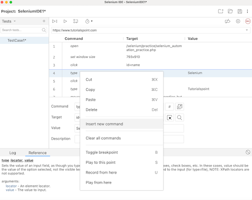

**Langkah 13** − Untuk menjalankan tes yang dibuat, klik tombol "Run current test" di bagian atas.

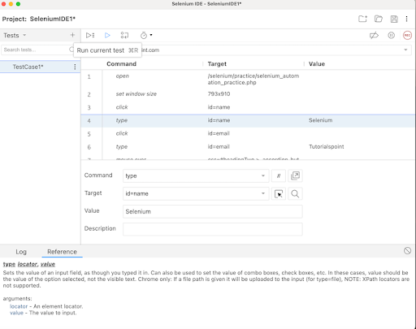

Jika terdapat beberapa tes, klik tombol "Run all tests".

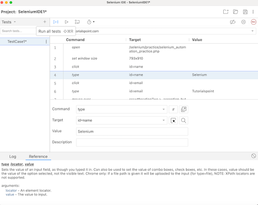

Jika terdapat breakpoint, klik tombol "Step over current command".

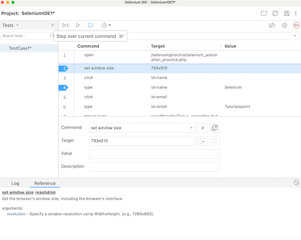

**Langkah 14** − Kita dapat mengontrol kecepatan eksekusi tes menggunakan tombol Test execution speed.

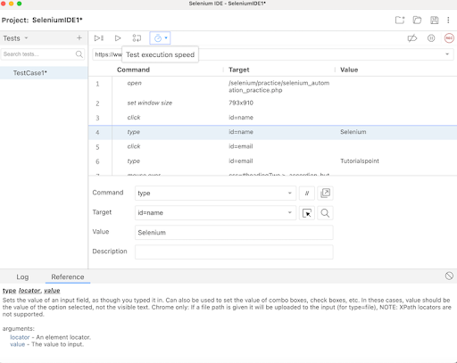

Secara default, kecepatan diatur ke Fast di Selenium IDE.

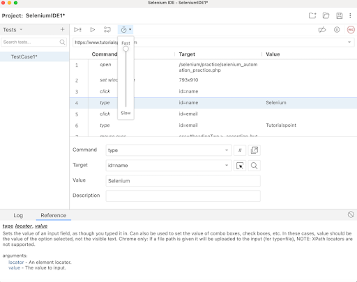

**Langkah 15** − Selenium IDE memberikan opsi untuk Create, Open, dan Save project menggunakan ikon di pojok kanan atas.

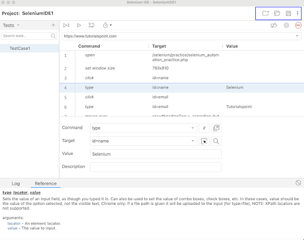

Simpan project dan lanjutkan. Setelah disimpan, kita perlu memberi nama dan lokasi tempat project disimpan.

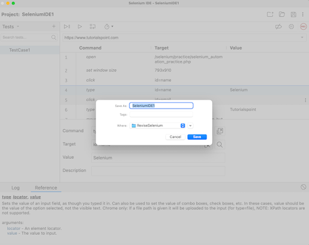

**Langkah 16** − Jalankan tes - TestCase1 menggunakan tombol Run current test.

**Langkah 17** − Setelah eksekusi selesai, kita mendapatkan pesan hasil. Jika tes lulus, kita mendapatkan pesan hijau.

Selain itu, semua langkah tes beserta nama test case berubah menjadi hijau, mencerminkan PASS untuk semua langkah.

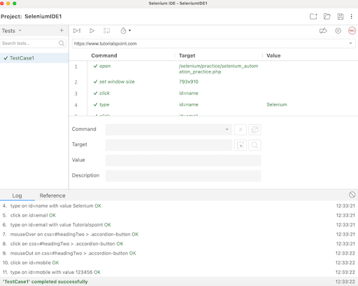

---

## Selenium IDE - Membuat Script

Selenium IDE dapat digunakan untuk membuat skrip tes otomasi. Setelah kita mulai membuat skrip di Selenium IDE, kita akan mendapatkan tampilan Test Script Editor Box.

### Komponen Test Script Editor

Dalam Test Script Editor Panel:
- **Command**: Berisi perintah Selenium
- **Target**: Berisi nilai locator, URL, dll
- **Value**: Berisi nilai yang akan dimasukkan

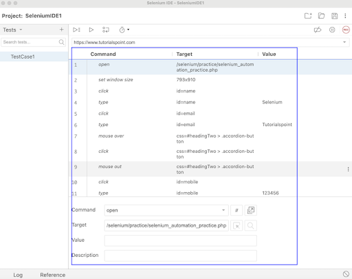

#### Mengaktifkan/Menonaktifkan Perintah

Jika suatu langkah dipilih, opsi Enable/Disable command akan aktif. Setelah tes dijalankan, semua langkah kecuali perintah yang dinonaktifkan akan dieksekusi.

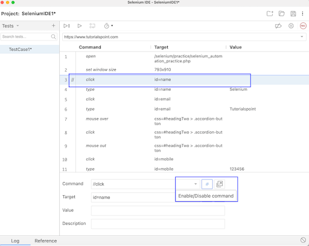

#### Konfigurasi New Window

Dalam beberapa kasus, setelah mengklik tautan/tombol di halaman web, jendela baru akan muncul. Konfigurasi ini perlu diatur.

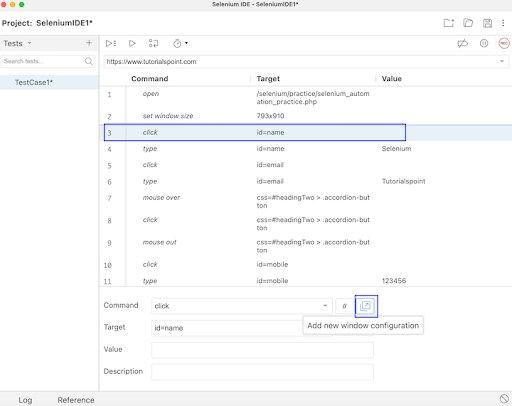

Pada popup yang muncul, centang checkbox "New Window Configuration".

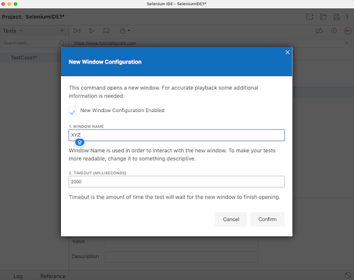

#### Select Target in Page

Untuk menemukan elemen secara otomatis, gunakan tombol "Select target in page".

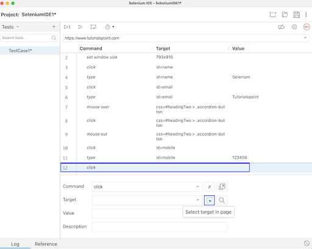

Setelah diklik, pengguna mendapat opsi untuk memilih elemen, dan berdasarkan itu, nilai locatornya akan dibuat.

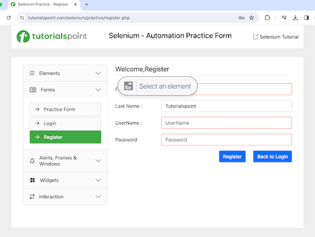

Nilai locator yang sesuai akan dibuat di field Target.

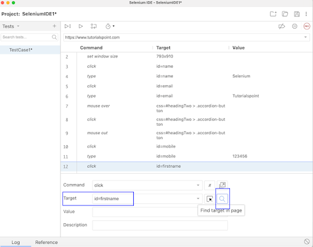

Tombol-tombol penting di Test Script Editor Panel:

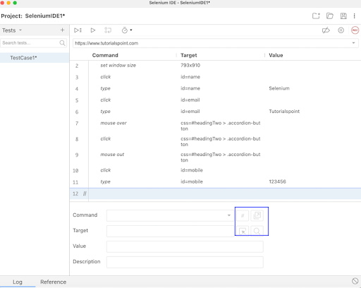

---

## Selenium IDE - Control Flow

Perintah Selenium IDE memiliki fitur yang memungkinkan penambahan pernyataan kondisional dan perulangan pada tes.

### Ekspresi JavaScript

Kondisi dalam aplikasi yang sedang diuji dapat diverifikasi dengan bantuan ekspresi JavaScript.

### Perintah Control Flow Dasar - Percabangan Kondisional

#### `if`
Perintah awal pada percabangan kondisional. Jika ekspresi mengembalikan nilai true, tes akan menjalankan langkah-langkah setelah ekspresi `if` sampai perintah control flow berikutnya.

#### `else if`
Digunakan di dalam blok perintah `if`. Mirip dengan perintah `if`, menerima perintah JavaScript untuk dievaluasi.

#### `else`
Digunakan untuk mengakomodasi kondisi terakhir dalam blok `if`. Jika tidak ada kondisi sebelumnya yang terpenuhi, blok `else` akan dieksekusi.

#### `end`
Digunakan untuk mengakhiri blok perintah kondisional. Tanpa perintah `end`, akan terjadi error.

### Perintah Control Flow Dasar - Perulangan

#### `times`
Digunakan untuk mendefinisikan jumlah iterasi dari suatu aksi yang perlu dilakukan.

#### `do`
Digunakan untuk memulai perulangan. Perintah `do` harus diakhiri dengan perintah `while`.

#### `while`
Jika ekspresi JavaScript mengembalikan nilai true, tes terus berulang. Jika false, perulangan berhenti.

#### `forEach`
Digunakan untuk melakukan perulangan melalui sebuah koleksi dan merujuk ke item individual di dalam koleksi.

### Contoh 1 - Menggunakan if/else

Berikut contoh pengecekan teks menggunakan if/else:

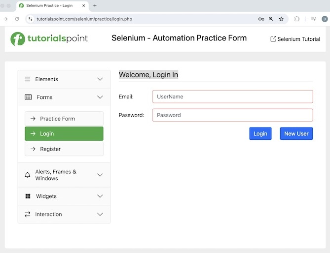

**Langkah-langkah:**

1. Buka Selenium IDE
2. Buat project baru
3. Masukkan: `open` di Command, `selenium` di Target
4. Masukkan: `store text` di Command, `xpath=//*[@id="signInForm"]/h1` di Target, `val` di Value
5. Masukkan: `if` di Command, `${val}==="Welcome, Login In"` di Target
6. Masukkan: `echo` di Command, `Correct Verification` di Target
7. Masukkan: `else if` di Command, `${val}==="Welcome, Register"` di Target
8. Masukkan: `echo` di Command, `InCorrect Verification` di Target
9. Masukkan: `else` di Command
10. Masukkan: `echo` di Command, `InValid Test` di Target
11. Masukkan: `end` di Command
12. Masukkan: `close` di Command

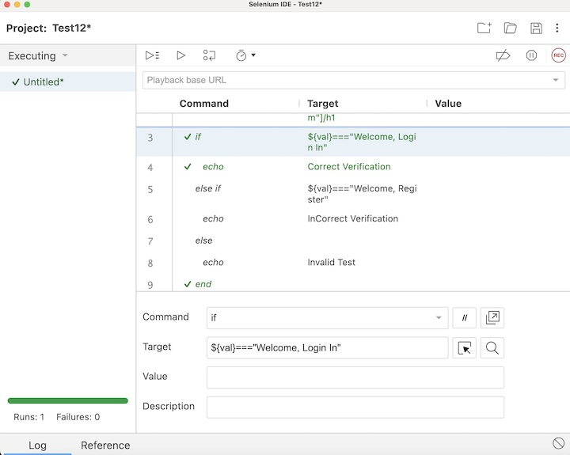

Klik "Run all tests" dan tunggu eksekusi selesai:


### Contoh 2 - Menggunakan `while`

**Langkah-langkah:**

1. Masukkan: `execute script` di Command, `return 1` di Target, `val` di Value
2. Masukkan: `while` di Command, `${val} < 3` di Target
3. Masukkan: `echo` di Command, `${val}` di Target
4. Masukkan: `execute script` di Command, `return ${val} + 1` di Target, `val` di Value
5. Masukkan: `end` di Command


Hasil eksekusi while:


---

## Selenium IDE - Store Variables

Selenium IDE dapat digunakan untuk menyimpan dan mengakses variabel saat membuat tes otomasi.

### Contoh - Menyimpan dan Mengakses Variabel

Contoh pengisian teks "Selenium" di field First Name dan "Tutorialspoint" di field Last Name:


### Langkah-langkah

**Langkah 1** − Buka Selenium IDE dari browser.

**Langkah 2** − Selenium IDE diluncurkan dengan pesan selamat datang.


**Langkah 3** − Klik "Create a new project".


**Langkah 4** − Workspace Selenium IDE siap digunakan.


**Langkah 5** − Masukkan `open` di Command, `https://www.tutorialspoint.com/selenium/` di Target.


**Langkah 6** − Masukkan `store` di Command, `Selenium` di Target, `i` di Value.

> **Catatan:** Perintah `store` menyimpan nilai "Selenium" ke dalam variabel `i`.


**Langkah 7** − Masukkan `type` di Command, `id=firstname` di Target, `${i}` di Value.

> **Catatan:** `${i}` merupakan cara mengakses variabel `i` yang telah disimpan sebelumnya.

**Langkah 8** − Masukkan `store` di Command, `Tutorialspoint` di Target, `j` di Value.

**Langkah 9** − Masukkan `type` di Command, `id=lastname` di Target, `${j}` di Value.


**Langkah 10** − Masukkan `store Text` di Command, `css=div > h1` di Target, `k` di Value.

> **Catatan:** `store Text` menyimpan teks dari elemen yang ditentukan ke dalam variabel `k`.

**Langkah 11** − Masukkan `echo` di Command, `${k}` di Target. Ini akan mencetak teks yang diakses dari halaman web.


**Langkah 12** − Masukkan `store value` di Command, `id=firstname` di Target, `l` di Value.

> **Catatan:** `store value` menyimpan nilai (value attribute) dari elemen ke variabel `l`.

**Langkah 13** − Masukkan `echo` di Command, `${l}` di Target.


**Langkah 14** − Masukkan `close` di Command.


**Langkah 15** − Klik pada tiga titik di panel kiri, pilih opsi Rename.


**Langkah 16** − Masukkan nama, misalnya TestCase2, lalu klik Rename.


**Langkah 17** − Klik "Run all tests" dan tunggu eksekusi selesai.


Dalam contoh di atas, kita mendapatkan teks "Selenium - Automation Practice Form" yang muncul di halaman web dan juga nilai yang dimasukkan di input box.

> **Catatan Penting:** Variabel yang digunakan di satu langkah dapat diakses di langkah lain menggunakan sintaks: `${<nama_variabel>}`


---

## Selenium IDE - Alerts & Popups

Selenium IDE dapat digunakan untuk menangani alerts dan popups. Alert pada halaman web dirancang untuk menampilkan pesan peringatan atau informasi kepada pengguna.

### Perintah Selenium IDE untuk Alerts dan Popups

| Perintah | Deskripsi |
|---|---|
| `webdriver answer on visible prompt` | Memasukkan teks pada prompt lalu klik OK |
| `webdriver choose ok on visible confirmation` | Mengklik OK dalam dialog konfirmasi |
| `webdriver choose cancel on visible confirmation` | Mengklik Cancel dalam dialog konfirmasi |
| `webdriver choose cancel on visible prompt` | Membatalkan prompt |
| `answer on next prompt` | Merencanakan jawaban prompt sebelum ditampilkan |
| `choose cancel on next prompt` | Merencanakan klik Cancel pada prompt |
| `choose ok on next confirmation` | Merencanakan klik OK pada konfirmasi |
| `assert prompt(text)` | Memverifikasi apakah prompt telah dirender |
| `assert alert(alert text)` | Memverifikasi apakah alert memiliki teks yang cocok |
| `assert confirmation(text)` | Memverifikasi apakah konfirmasi telah dirender |

### Contoh 1 - Menangani Prompt dan Alert

Contoh klik tombol yang menghasilkan prompt dan alert:


Alert dengan teks "Hello World!":


**Langkah-langkah:**

1. Buka Selenium IDE
2. Buat project baru
3. Masukkan: `open` di Command, `https://www.tutorialspoint.com/selenium/` di Target
4. Masukkan: `answer on next prompt` di Command, `Tutorialspoint` di Value
5. Masukkan: `click` di Command, `xpath=/html/body/main/div/div/div[2]/div[4]/button` di Target
6. Masukkan: `click` di Command, `xpath=/html/body/main/div/div/div[2]/div[1]/button` di Target
7. Masukkan: `assert alert` di Command, `Hello World!` di Value
8. Masukkan: `close` di Command


Hasil eksekusi:


### Contoh 2 - Menangani Confirmation Dialog

Contoh halaman dengan dialog konfirmasi:


Setelah dialog konfirmasi ditutup, teks "You pressed OK!" muncul:


**Langkah-langkah:**

1. Ikuti langkah 1-5 dari Contoh 1
2. Masukkan: `choose ok on next confirmation` di Command
3. Masukkan: `click` di Command, `xpath=/html/body/main/div/div/div[2]/div[3]/button` di Target
4. Masukkan: `assert text` di Command, `xpath=//*[@id="desk"]` di Target, `You pressed OK!` di Value
5. Masukkan: `close` di Command


Hasil eksekusi:


---

## Selenium IDE - Perintah Selenese

Setiap perintah yang digunakan di Selenium IDE disebut perintah Selenese. Menggunakan perintah Selenese kita dapat melakukan semua aksi pengujian.

Tiga kategori perintah:
- **Actions Command** - memanipulasi state aplikasi
- **Accessors Command** - mengakses dan menyimpan state aplikasi
- **Assertions Command** - memverifikasi state aplikasi

> **Definisi Selenese:** Selenese adalah bahasa yang digunakan untuk membuat otomasi tes menggunakan Selenium IDE.

### Perintah Actions Dasar

```
click(locator)
check(locator)
uncheck(locator)
choose cancel on next confirmation
choose cancel on next prompt
choose ok on next confirmation
click At(locator, coordinateString)
close
debugger
double click(locator)
drag and drop to object(source locator, destination locator)
echo(message)
edit content(locator, value)
execute script(script, variable name)
execute async script(script, variable name)
mouse down(locator)
mouse move at(locator, coordinateString)
mouse out(locator)
mouse over(locator)
mouse up(locator)
open(url)
pause(wait time)
remove selection(locator, option)
run(test case)
select(locator, option)
select frame(locator)
select window(window handle)
set window size(resolution)
type(locator)
```

### Perintah Accessors Dasar

```
store(text, variable)
store attribute(locator, variable)
store text(locator, variable)
store title(text, variable)
store value(locator, variable)
store window handle(window handle)
store xpath count(xpath, variable)
```

### Perintah Assertions Dasar

```
assert(variable, expected value)
assert alert(alert text)
assert checked(locator)
assert confirmation(text)
assert editable(locator)
assert element present(locator)
assert element not present(locator)
assert not checked(locator)
assert not editable(locator)
assert not selected value(locator, text)
assert not text(locator, text)
assert prompt(text)
assert selected value(locator, text)
assert selected label(locator, text)
assert text(locator, text)
assert title(text)
assert value(locator, text)
verify(variable, expected value)
verify checked(locator)
verify editable(locator)
verify element present(locator)
verify element not present(locator)
verify not editable(locator)
verify not selected value(locator, text)
verify not text(locator, text)
verify selected label(locator, text)
verify selected value(locator, text)
verify text(locator, text)
verify value(locator, text)
wait for element editable(locator, wait time)
wait for element not editable(locator, wait time)
wait for element not present(locator, wait time)
wait for element not visible(locator, wait time)
wait for element present(locator, wait time)
wait for element visible(locator, wait time)
```

### Contoh Penggunaan Selenese Commands

Contoh menangkap judul halaman dan memverifikasi teks setelah mengklik radio button:


Setelah memilih radio button, teks "You have checked Yes" muncul untuk diverifikasi:


**Langkah-langkah:**

1. Buka Selenium IDE dan buat project baru.


2. Masukkan: `open` di Command
3. Masukkan: `store title` di Command, `pageTitle` di Value
4. Masukkan: `echo` di Command, `${pageTitle}` di Target
5. Masukkan: `click` di Command dengan xpath radio button di Target
6. Masukkan: `assert element present` di Command, `xpath=//*[@id="check"]` di Target


7. Klik "Run all tests":


---

## Selenium IDE - Perintah Actions

Semua perintah di Selenium IDE disebut Selenese. Berikut adalah deskripsi detail setiap perintah Actions:

| Perintah | Deskripsi |
|---|---|
| `click(locator)` | Mengklik link, tombol, checkbox, atau radio button |
| `check(locator)` | Mencentang radio button atau checkbox |
| `uncheck(locator)` | Menghapus centang radio button atau checkbox |
| `choose cancel on next confirmation` | Membatalkan konfirmasi berikutnya |
| `choose cancel on next prompt` | Membatalkan prompt berikutnya |
| `choose ok on next confirmation` | Menerima konfirmasi berikutnya |
| `click At(locator, coordinateString)` | Mengklik elemen pada koordinat tertentu |
| `close` | Menutup window saat ini |
| `debugger` | Menjeda eksekusi tes untuk debugging |
| `double click(locator)` | Double-klik pada elemen |
| `drag and drop to object(source, dest)` | Drag elemen dari sumber ke tujuan |
| `echo(message)` | Mencetak pesan (untuk debugging) |
| `edit content(locator, value)` | Memasukkan nilai ke elemen yang dapat diedit |
| `execute script(script, var)` | Menjalankan perintah JavaScript |
| `execute async script(script, var)` | Menjalankan JavaScript asinkron |
| `mouse down(locator)` | Simulasi menekan tombol kiri mouse |
| `mouse move at(locator, coord)` | Simulasi gerakan mouse ke koordinat |
| `mouse out(locator)` | Simulasi pointer mouse menjauh dari elemen |
| `mouse over(locator)` | Simulasi hover mouse pada elemen |
| `mouse up(locator)` | Simulasi melepaskan tombol mouse |
| `open(url)` | Membuka URL dan menunggu halaman dimuat |
| `pause(wait time)` | Menghentikan eksekusi sementara |
| `remove selection(locator, option)` | Membatalkan pilihan opsi dalam dropdown multi-select |
| `run(test case)` | Menjalankan test case |
| `select(locator, option)` | Memilih opsi dalam dropdown |
| `select frame(locator)` | Memilih frame dalam window |
| `select window(window handle)` | Memilih popup window dengan handle id |
| `set window size(resolution)` | Mengatur ukuran window browser |
| `type(locator)` | Memasukkan teks ke input box |

### Contoh Perintah Actions

Contoh membuka aplikasi dan memasukkan teks "Selenium" di input box:


**Langkah-langkah:**

1. Buat workspace di Selenium IDE
2. Masukkan: `open` di Command, `Selenium Automation Practice Form` di Target
3. Masukkan: `type` di Command, `id=name` di Target, `Selenium` di Value
4. Masukkan: `close` di Command


5. Rename test case


6. Klik "Run all tests":


---

## Selenium IDE - Perintah Accessors

Accessor command adalah perintah yang digunakan untuk mengakses dan mengevaluasi state aplikasi dan menyimpannya dalam variabel. Untuk mendapatkan perintah Accessor di Selenium IDE, ketik `store` pada field Command.


### Contoh 1 - Store Text dan Store Value

Contoh menyimpan nilai dari halaman web ke dalam variabel:


**Langkah-langkah:**

1. Buka Selenium IDE dan buat workspace.
2. Masukkan: `open` di Command


3. Masukkan: `store` di Command, `Selenium` di Target, `i` di Value


4. Masukkan: `type` di Command, `id=firstname` di Target, `${i}` di Value
5. Masukkan: `store` di Command, `Tutorialspoint` di Target, `j` di Value
6. Masukkan: `type` di Command, `id=lastname` di Target, `${j}` di Value


7. Masukkan: `store Text` di Command, `css=div > h1` di Target, `k` di Value
8. Masukkan: `echo` di Command, `${k}` di Target


9. Masukkan: `store value` di Command, `id=firstname` di Target, `l` di Value
10. Masukkan: `echo` di Command, `${l}` di Target


11. Masukkan: `close` di Command


12. Rename test case


13. Klik "Run all tests":


Hasil akhir dengan semua langkah berwarna hijau:


### Contoh 2 - Store Title

Contoh menangkap judul halaman:


**Langkah-langkah:**

1. Ikuti langkah 1-4 dari contoh sebelumnya.
2. Masukkan: `open` di Command
3. Masukkan: `store title` di Command, `pageTitle` di Value
4. Masukkan: `echo` di Command, `${pageTitle}` di Target


Hasil eksekusi:


---

## Selenium IDE - Perintah Assertions

Semua perintah di Selenium IDE disebut Selenese. Perintah Assertions digunakan untuk memverifikasi state aplikasi.

### Kategori Perintah Assertions

- **Actions** − Mengubah state aplikasi. Contoh: `close`, `click`, `type`, `open`
- **Accessors** − Mengukur state aplikasi dan menyimpan ke variabel. Contoh: `store`, `storeText`, `storeTitle`
- **Assertions** − Memverifikasi state aplikasi. Sub-tipe: `assert`, `verify`, `waitFor`

### Deskripsi Detail Perintah Assertions

| Perintah | Deskripsi |
|---|---|
| `assert(variable, expected value)` | Verifikasi variabel cocok dengan nilai yang diharapkan. Jika gagal, eksekusi berhenti. |
| `assert alert(alert text)` | Verifikasi alert memiliki teks yang cocok. Jika gagal, eksekusi berhenti. |
| `assert checked(locator)` | Verifikasi elemen target dengan locator sudah dicentang. |
| `assert confirmation(text)` | Verifikasi konfirmasi telah dirender. |
| `assert editable(locator)` | Verifikasi elemen target dapat diedit. |
| `assert element present(locator)` | Verifikasi elemen target tersedia di halaman. |
| `assert element not present(locator)` | Verifikasi elemen target tidak ada di halaman. |
| `assert not checked(locator)` | Verifikasi elemen tidak dicentang. |
| `assert not editable(locator)` | Verifikasi elemen tidak dapat diedit. |
| `assert not selected value(locator, text)` | Verifikasi nilai atribut opsi yang dipilih TIDAK cocok dengan teks. |
| `assert not text(locator, text)` | Verifikasi elemen TIDAK memiliki teks yang diberikan. |
| `assert prompt(text)` | Verifikasi prompt telah dirender. |
| `assert selected value(locator, text)` | Verifikasi nilai atribut opsi yang dipilih cocok dengan teks. |
| `assert selected label(locator, text)` | Verifikasi label opsi yang dipilih cocok dengan teks. |
| `assert text(locator, text)` | Verifikasi elemen memiliki teks yang diberikan. |
| `assert value(locator, text)` | Verifikasi nilai edit box. |
| `assert title(text)` | Verifikasi judul halaman sesuai. |
| `verify(variable, expected value)` | Mirip assert, tapi jika gagal, eksekusi TIDAK berhenti (melanjutkan ke langkah berikutnya). |
| `verify checked(locator)` | Verifikasi elemen dicentang (non-fatal). |
| `verify editable(locator)` | Verifikasi elemen dapat diedit (non-fatal). |
| `wait for element editable(locator, wait)` | Menunggu elemen dapat diedit dalam waktu tertentu. |
| `wait for element not present(locator, wait)` | Menunggu elemen tidak ada dalam waktu tertentu. |
| `wait for element present(locator, wait)` | Menunggu elemen ada dalam waktu tertentu. |
| `wait for element visible(locator, wait)` | Menunggu elemen terlihat dalam waktu tertentu. |

### Contoh Penggunaan Assertions

Contoh mengklik tautan "Created" dan memverifikasi judul halaman:


Setelah klik tautan, teks "Link: Created" muncul:


**Langkah-langkah:**

1. Buat workspace di Selenium IDE
2. Masukkan: `open` di Command
3. Masukkan: `verify title` di Command, `Selenium Practice - Links` di Target
4. Masukkan: `click` di Command, `xpath=//*[@id="created"]` di Target
5. Masukkan: `wait for element visible` di Command, `xpath=/html/body/main/div/div/div[2]/div[1]` di Target, `3000` di Value
6. Masukkan: `assert text` di Command, `xpath=/html/body/main/div/div/div[2]/div[1]` di Target, `Link: Created` di Value
7. Masukkan: `close` di Command


8. Klik "Run all tests":


---

## Selenium IDE - Metode Assert/Verify

Selenium IDE menggunakan metode assert dan verify untuk memeriksa apakah teks, elemen, judul halaman, dll. cocok dengan nilai yang diharapkan.

### Perintah Assert

Dalam Selenium IDE, perintah `assert` digunakan untuk memverifikasi apakah situasi tertentu cocok dengan dokumen spesifikasi. **Jika assert gagal, eksekusi tes berhenti seketika.**

#### Contoh dengan Assert

Contoh menangkap judul halaman dan memeriksa apakah cocok dengan "ABC":


**Langkah-langkah:**

1. Buka Selenium IDE
2. Masukkan: `open` di Command
3. Masukkan: `store title` di Command, `pageTitle` di Value
4. Masukkan: `assert title` di Command, `ABC` di Target *(Sengaja memasukkan nilai yang salah)*
5. Masukkan: `echo` di Command, `${pageTitle}` di Target
6. Masukkan: `close` di Command
7. Rename test case dan klik "Run all tests":


> **Penjelasan:** Judul halaman aktual adalah "Selenium Practice Radio Button", bukan "ABC". Karena `assert` digunakan, eksekusi **berhenti** pada langkah yang gagal.

### Perintah Verify

Dalam Selenium IDE, perintah `verify` juga digunakan untuk memverifikasi. **Perbedaannya: jika verify gagal, eksekusi TIDAK berhenti, melanjutkan ke langkah berikutnya.**

#### Contoh dengan Verify

Sama seperti contoh sebelumnya, tetapi menggunakan `verify title` dengan nilai "ABC":

**Langkah-langkah:**

1. Ikuti langkah yang sama dengan contoh Assert
2. Di langkah 4, gunakan `verify title` sebagai gantinya di Command, `ABC` di Target


> **Hasil:** Terdapat kegagalan, namun eksekusi **tetap berlanjut** ke langkah berikutnya (tidak berhenti).

### Perbedaan Assert vs Verify

| Aspek | assert | verify |
|---|---|---|
| Jika gagal | Eksekusi BERHENTI | Eksekusi BERLANJUT |
| Penggunaan | Kondisi kritis | Kondisi non-kritis |
| Laporan | Langsung gagal | Mencatat kegagalan, lanjut |

---

## Selenium IDE - Strategi Pencarian Elemen (Locating Strategies)

Selenium IDE memiliki berbagai strategi pencarian elemen untuk mengotomatisasi test case. Strategi locator yang didukung:

- **id** - Berdasarkan atribut id elemen
- **name** - Berdasarkan atribut name elemen
- **css** - Berdasarkan CSS selector
- **xpath** - Berdasarkan ekspresi XPath

### Mengidentifikasi Elemen Web

Klik kanan pada halaman web, pilih "Inspect" di browser Chrome, dan kode HTML untuk halaman tersebut akan muncul.

Contoh halaman form untuk demonstrasi:


Setelah klik kanan dan Inspect pada elemen:


Kode HTML elemen yang dipilih:


### Fitur Menemukan Elemen di Selenium IDE

Setelah membuat tes dengan perekaman di Selenium IDE, kita dapat melihat detail locator. Contoh langkah ke-4 dengan Command `type`, Target `id=name`, Value `Selenium`:


Text Script Editor Pane dengan semua interaksi yang direkam:


Menggunakan tombol "Select target in page":


Setelah klik, pilih elemen di halaman web dan locator-nya akan dibuat otomatis:


Locator yang dibuat di field Target:


Tombol Find/Select target:


### Locator ID

Menggunakan `id` locator untuk menemukan input box dan memasukkan teks:

**Langkah-langkah:**

1. Buat workspace di Selenium IDE
2. Masukkan: `open` di Command


3. Masukkan: `type` di Command, `id=firstname` di Target, `Selenium` di Value


4. Masukkan: `close` di Command


5. Klik "Run all tests":


### Locator Name

Menggunakan `name` locator:

1. Ubah langkah ke-2: `type` di Command, `name=firstname` di Target


2. Klik "Run all tests":


### Locator CSS

Menggunakan `css` locator:

1. Ubah langkah ke-2: `type` di Command, `css=input#firstname` di Target


2. Klik "Run all tests":


### Locator XPath

Menggunakan `xpath` locator:

1. Ubah langkah ke-2: `type` di Command, `xpath=//input[@id='firstname']` di Target


2. Klik "Run all tests":


---

## Selenium IDE - Debugging Script

Selenium IDE menyediakan berbagai opsi debugging skrip untuk memecahkan masalah skrip yang gagal.

### Step-By-Step Execution (Eksekusi Langkah-demi-Langkah)

Tombol "Step over current command" memungkinkan Anda menjalankan tes langkah demi langkah untuk memeriksa jika ada yang tidak berfungsi.


Dengan mengklik tombol ini berulang kali, kita dapat melihat jika ada langkah tes yang tidak berfungsi seperti yang diharapkan:


Tombol "Resume test execution" untuk melanjutkan eksekusi:


Setelah mengklik "Step over" lagi, langkah berikutnya dieksekusi:


### Menambahkan Breakpoints

Kita dapat mengklik nomor baris dalam tes untuk menambahkan breakpoint:


Saat eksekusi berjalan dan mencapai breakpoint, eksekusi otomatis berhenti dengan pesan "Paused in debugger". Klik "Step over" untuk melanjutkan ke langkah berikutnya:


Proses dilanjutkan ke langkah berikutnya:


Hasil akhir eksekusi dengan breakpoints:


Menonaktifkan semua breakpoints dengan tombol "Disable breakpoints":


Breakpoint juga dapat dihapus/ditambahkan dengan klik kanan pada langkah dan memilih "Toggle Breakpoint":


### Debugger Command

Kita dapat menjeda tes Selenium IDE secara programatis menggunakan perintah JavaScript `debugger`. Klik kanan pada langkah dan pilih "Insert command":


Masukkan `debugger` di field Command untuk menjeda eksekusi:


Eksekusi akan berhenti di langkah debugger dan kita perlu melanjutkan menggunakan tombol Resume:


Hasil akhir setelah debugging:


### Pause on Exceptions

Fitur "Pause on Exception" di Selenium IDE membantu menjeda eksekusi tes jika terjadi error.

Contoh dengan langkah yang sengaja gagal (mengubah locator):


Hasil: tes gagal dan langkah setelahnya tidak dieksekusi:


Untuk mencegah eksekusi dibatalkan, klik tombol "Pause on exceptions":


Eksekusi berhenti di baris 2 (locator salah) dengan pesan "Paused in debugger":


Setelah memperbaiki nilai locator dari `id=names` menjadi `id=name`, klik "Resume test execution":


Hasil setelah perbaikan dan resume:


---

## Selenium IDE - Titik Verifikasi (Verification Points)

Selenium IDE memungkinkan penambahan berbagai titik verifikasi dalam test case untuk memeriksa apakah aplikasi bekerja sesuai harapan. Perintah assertions (assert, verify, waitFor) membantu menambahkan titik verifikasi.

### Cara Menambahkan Titik Verifikasi Saat Perekaman

Titik verifikasi dapat ditambahkan saat merekam tes di Selenium IDE. Berikut adalah contoh menambahkan titik verifikasi `assert`:


Menambahkan titik verifikasi `verify` dengan klik kanan pada elemen:


Menambahkan titik verifikasi `wait for`:


### Daftar Perintah Verifikasi di Selenium IDE

```
assert(variable, expected value)
assert alert(alert text)
assert checked(locator)
assert confirmation(text)
assert editable(locator)
assert element present(locator)
assert element not present(locator)
assert not checked(locator)
assert not editable(locator)
assert not selected value(locator, text)
assert not text(locator, text)
assert prompt(text)
assert selected value(locator, text)
assert selected label(locator, text)
assert text(locator, text)
assert title(text)
assert value(locator, text)
verify(variable, expected value)
verify checked(locator)
verify editable(locator)
verify element present(locator)
verify element not present(locator)
verify not editable(locator)
verify not selected value(locator, text)
verify not text(locator, text)
verify selected label(locator, text)
verify selected value(locator, text)
verify text(locator, text)
verify value(locator, text)
wait for element editable(locator, wait time)
wait for element not editable(locator, wait time)
wait for element not present(locator, wait time)
wait for element not visible(locator, wait time)
wait for element present(locator, wait time)
wait for element visible(locator, wait time)
```

### Contoh Titik Verifikasi

Contoh mengklik tautan "Created" dan memverifikasi judul halaman serta teks yang muncul:


Tampilan setelah klik tautan:


**Langkah-langkah:**

1. Buka Selenium IDE dan buat project baru
2. Masukkan: `open` di Command
3. Masukkan: `verify title` di Command, `Selenium Practice - Links` di Target
4. Masukkan: `click` di Command, `xpath=//*[@id="created"]` di Target
5. Masukkan: `wait for element visible` di Command dengan xpath dan waktu tunggu 3000ms di Value
6. Masukkan: `assert text` di Command dengan xpath dan `Link: Created` di Value
7. Masukkan: `close` di Command


8. Rename dan jalankan tes:


---

## Selenium IDE - Pattern Matching

Selenium IDE dapat digunakan untuk pencocokan pola (pattern matching) terutama untuk tes yang memerlukan skenario verifikasi. Pattern matching biasanya digunakan dengan perintah verifikasi seperti `verify text`, `verify not text`, `verify title`, dll.

### Metode Pattern Matching yang Tersedia

- **Globbing**
- **Regular Expressions**
- **Exact Matching**


### Globbing

Globbing digunakan untuk mencocokkan string berdasarkan ekspresi karakter wildcard.

Karakter wildcard yang tersedia:
- `*` - cocok dengan karakter dalam jumlah berapa pun
- `?` - cocok dengan satu karakter saja
- `[...]` - cocok dengan salah satu karakter yang ada di dalam kurung

Contoh halaman untuk demonstrasi globbing:


**Langkah-langkah menggunakan globbing:**

1. Buat workspace di Selenium IDE
2. Masukkan: `open` di Command
3. Masukkan: `assert text` di Command, `xpath=...` di Target, `glob: Alerts*` di Value

> **Catatan:** Prefix `glob:` digunakan untuk globbing. Pola `Alerts*` akan cocok dengan teks yang dimulai dengan "Alerts" diikuti karakter apa pun.

4. Masukkan: `assert text` di Command, xpath header di Target, `glob: Selenium*` di Value
5. Masukkan: `close` di Command


### Exact Matching

Exact matching digunakan untuk mencocokkan string persis seperti yang ada.

**Penggunaan:** Gunakan prefix `exact:` sebelum nilai yang ingin dicocokkan.

Contoh: `exact: Alerts` hanya akan cocok dengan teks "Alerts" persis (bukan "Alerts and Popups").

**Langkah-langkah:**

1. Ikuti langkah 1-5 dari contoh globbing
2. Di nilai Target, gunakan format: `exact: Alerts`
3. Di nilai Target, gunakan format: `exact: Selenium - Automation Practice Form`

### Regular Expressions

Regular expressions (Regex) adalah teknik pencocokan pola yang paling fleksibel. Selenium mendukung regex lengkap dari JavaScript.

**Prefix yang digunakan:**
- `regexp:` - pencocokan case-sensitive
- `regexpi:` - pencocokan case-insensitive

**Contoh:**
- `regexp: ^Alert.*` - Mencocokkan teks yang dimulai dengan "Alert"
- `regexpi: selenium` - Mencocokkan "selenium", "Selenium", "SELENIUM", dll.

---

## Selenium IDE - File JSON

Selenium IDE dapat digunakan untuk bekerja dengan file JSON. JSON (JavaScript Object Notation) adalah format pertukaran data yang mudah dibaca oleh manusia dan mesin.

### Perintah 'store json' di Selenium IDE

Selenium IDE dapat bekerja dengan data JSON menggunakan perintah `store json`. Ini adalah perintah accessor yang menyimpan data JSON ke dalam variabel.


### Contoh - Menyimpan Data JSON ke Variabel

**Langkah-langkah:**

1. Buka Selenium IDE
2. Masukkan: `open` di Command
3. Masukkan: `store json` di Command, `{"Language":"Java","Name":"Selenium"}` di Target, `val` di Value
4. Masukkan: `echo` di Command, `${val}` di Target
5. Masukkan: `close` di Command


6. Klik "Run all tests":


Setelah tes dieksekusi, project disimpan dalam file dengan ekstensi `.side`:


### Struktur File JSON (.side)

File `.side` yang dihasilkan berisi data JSON lengkap dari tes:

```json
{
    "id": "9da88821-edda-4f81-9e7b-57b89080eadc",
    "version": "2.0",
    "name": "Test13",
    "url": "",
    "tests": [{
        "id": "a87746b2-6478-47ce-b241-196675f0c91d",
        "name": "Untitled",
        "commands": [
            {
                "id": "86c94e67-93ba-44ba-89c5-170d1669f333",
                "command": "open",
                "target": "https://www.tutorialspoint.com/selenium/practice/register.php",
                "value": ""
            },
            {
                "id": "62ed3587-a53b-4f10-ad98-90fc3223018a",
                "command": "storeJson",
                "target": "{\"Language\":\"Java\", \"Name\":\"Selenium\"}",
                "value": "val"
            },
            {
                "id": "d5676067-fb60-46fa-9b02-cd7a0b2ae630",
                "command": "echo",
                "target": "${val}",
                "value": ""
            },
            {
                "id": "3ce68f7d-2958-4e66-ad33-d9b9a4e5aa7f",
                "command": "close",
                "target": "",
                "value": ""
            }
        ]
    }],
    "suites": [{
        "id": "7f58de7c-b22c-4fd1-bd59-00e4644995a6",
        "name": "Default Suite",
        "persistSession": false,
        "parallel": false,
        "timeout": 300,
        "tests": ["a87746b2-6478-47ce-b241-196675f0c91d"]
    }],
    "urls": [],
    "plugins": []
}
```

---

## Selenium IDE - Eksekusi di Berbagai Browser

Test case yang dikembangkan di Selenium IDE harus dapat berjalan di berbagai browser seperti Chrome, Firefox, Safari, Edge, dll.

### Mengapa Eksekusi Lintas Browser Bermanfaat?

Sering kali pada aplikasi e-commerce, reservasi perjalanan, dll., kita mengamati bahwa saat menggunakan satu browser tertentu, terjadi masalah seperti gambar tidak dimuat, layout rusak, atau fungsi tidak bekerja. Hal ini menunjukkan perlunya pengujian di berbagai browser.

### Prasyarat untuk Eksekusi Lintas Browser Selenium IDE

1. Instal Selenium IDE di sistem lokal (Chrome atau Firefox)
2. Instal Node.js (versi di atas 10) dari: https://nodejs.org/en/download/
3. Verifikasi Node.js: `node -v`
4. Instal Selenium side runner: `npm install -g selenium-side-runner`

### Langkah-langkah Menjalankan Tes di Berbagai Browser

**Langkah 1-9:** Buat dan simpan tes di Selenium IDE (lihat bagian Membuat Test)

**Langkah 1** − Buka Selenium IDE:


**Langkah 4** − Workspace siap:


**Langkah 7** − Script selesai:


**Langkah 9** − Rename test case:


**Langkah 10** − Jalankan tes:


**Langkah 11** − Simpan project sebagai file `Test7.side`:


**Langkah 12** − Untuk menjalankan di Chrome:
```bash
npm install -g chromedriver
```
Untuk Firefox:
```bash
npm install -g geckodriver
```

**Langkah 13** − Jalankan Selenium Side Runner:
```bash
selenium-side-runner Test7.side
```

### Kemampuan Browser untuk Eksekusi di Berbagai Browser

```bash
# Chrome
selenium-side-runner -c "browserName=chrome"

# Safari
selenium-side-runner -c "browserName=safari"

# Edge
selenium-side-runner -c "browserName=edge"

# Internet Explorer
selenium-side-runner -c "browserName=internet explorer"

# Firefox
selenium-side-runner -c "browserName=firefox"
```

---

## Selenium - User Extensions

Selenium IDE dapat diperluas dengan menambahkan aksi, assertions, dan strategi locator yang disesuaikan melalui User Extensions.

### Menambahkan 'while' Loop di Selenium IDE dengan JavaScript

**Langkah 1** − Navigasi ke URL berikut dan copy seluruh konten file sideflow.js, kemudian simpan ke komputer lokal:
https://github.com/darrenderidder/sideflow/blob/master/sideflow.js


**Langkah 2** − Buka Selenium IDE dan navigasi ke "Options" >> "Options":


**Langkah 3** − Klik tombol 'Browse' di bagian 'Selenium Core Extensions' dan arahkan ke file js yang telah disimpan:


**Langkah 4** − Restart Selenium IDE.

**Langkah 5** − Sekarang Anda akan memiliki akses ke beberapa perintah tambahan seperti "Label", "While", dll.

**Langkah 6** − Kini kita dapat membuat While loop di Selenium IDE:


---

## Selenium IDE - Ekspor Kode

Kode Selenium IDE yang dihasilkan dengan merekam tes dapat diekspor ke bahasa lain seperti Java, C#, Python, JavaScript, Ruby, dll. Fitur ini sangat berguna untuk diintegrasikan ke dalam pipeline CI/CD atau digunakan lebih lanjut dengan framework seperti JUnit, TestNG, dll.

### Bahasa yang Didukung untuk Ekspor

- C# Unit
- Java JUnit
- JavaScript Mocha
- Python pytest
- Ruby RSpec

### Langkah-langkah Ekspor Kode

**Langkah 1** − Ikuti langkah-langkah pembuatan tes di Selenium IDE (Langkah 1-8).

**Langkah 2** − Simpan project di lokasi tertentu:


**Langkah 3** − Jalankan tes dan tunggu hingga selesai:


**Langkah 4** − Setelah eksekusi berhasil, kita dapat mengekspor kodenya. Klik tiga titik di samping nama test case:


**Langkah 5** − Pilih opsi "Export" dari dropdown:


**Langkah 6** − Pilih bahasa tujuan ekspor dan klik tombol Export:


**Langkah 7** − Tentukan nama dan lokasi penyimpanan file kode yang diekspor, lalu klik Save. Jika bahasa yang dipilih adalah Java JUnit, ekstensi file yang dihasilkan adalah `.java`.

**Langkah 8** − Import file ini ke IntelliJ atau Eclipse dan tambahkan dependensi yang diperlukan.

### Memproses Kode yang Diekspor dan Menambahkan Dependensi

**Langkah 1** − Kode Java JUnit yang diekspor bekerja dengan Java versi 8 ke atas, JUnit 4.12, dan versi Selenium terbaru.

**Langkah 2** − Untuk menggunakan kembali kode yang diekspor dari Selenium IDE, tambahkan dependensi Selenium dan JUnit Maven ke file `pom.xml`:

```xml
<dependencies>
    <!-- Selenium -->
    <dependency>
        <groupId>org.seleniumhq.selenium</groupId>
        <artifactId>selenium-java</artifactId>
        <version>4.11.0</version>
    </dependency>
    <!-- JUnit -->
    <dependency>
        <groupId>junit</groupId>
        <artifactId>junit</artifactId>
        <version>4.13.2</version>
        <scope>test</scope>
    </dependency>
</dependencies>
```

---

## Selenium IDE - Emitting Code

Selenium IDE adalah alat penting yang digunakan secara ekstensif untuk fitur rekam dan putar ulang. Selenium IDE terdiri dari dua komponen penting: Selenium IDE itu sendiri dan Selenium Side Runner.

### Lingkungan Selenium SIDE Runner

Selenium runner dibangun di atas Node.js. Persyaratan lainnya:

- Node.js Versi 8 ke atas
- Jest
- Jest Environment Selenium
- Selenium Webdriver

### Cara Emit Code

Saat menghasilkan kode (emitting code), ada beberapa hal yang perlu diperhatikan karena plugin bukan satu-satunya yang menghasilkan kode.

#### Hindari Penggunaan Return

Kode setelah penggunaan kata kunci `return` tidak pernah dieksekusi dan menghentikan kerja plugin lain. Contoh **SALAH**:

```javascript
return promise1();
plugin1func(); // setelah return, baris ini tidak bisa dicapai
```

Sebaiknya gunakan `await`:

```javascript
await promise1();
plugin1func(); // ini akan bekerja
```

#### Hindari Mendefinisikan Variabel Secara Global

Mendefinisikan variabel di level global berarti jika plugin lain atau Selenium IDE mendefinisikan variabel yang sama, akan terjadi konflik. Contoh **SALAH**:

```javascript
// Dari script Selenium IDE:
// store | button | ele
// plugin click | button
// assert element present | xpath=${ele}

// Kode yang dihasilkan (BERMASALAH):
let ele = "button";
let ele = await driver.findElement(); // error: deklarasi ulang
await ele.click();
expect(ele).toBePresent(); // ambiguitas
```

Sebaiknya gunakan `then` dari Promise:

```javascript
let ele = "button";
await driver.findElement().then(ele => {
    return ele.click();
});
expect(ele).toBePresent(); // menggunakan variabel "button" yang benar
```

---

## Selenium IDE - Fungsi JavaScript

Selenium IDE dapat digunakan untuk menjalankan perintah JavaScript untuk berinteraksi dengan elemen yang muncul di halaman browser.

### Perintah Dasar untuk Fungsi JavaScript

| Perintah | Deskripsi |
|---|---|
| `execute script` | Menjalankan JavaScript dalam window atau frame yang aktif. Mendukung fungsi anonim dan nilai return. |
| `execute async script` | Pendekatan multi-thread untuk menjalankan tugas JavaScript secara asinkron. |
| `run script` | Memungkinkan menjalankan fungsi JavaScript dari Selenium IDE. |

### Contoh 1 - Membuat Alert dengan JavaScript

Membuat alert "Tutorialspoint" menggunakan fungsi JavaScript:


**Langkah-langkah:**

1. Buka Selenium IDE dan buat project baru
2. Masukkan: `open` di Command
3. Masukkan: `execute script` di Command, `alert("Tutorialspoint")` di Target
4. Masukkan: `close` di Command
5. Rename test case


6. Klik "Run all tests":


### Contoh 2 - Mengakses Teks dan Memasukkan Nilai

Contoh mengakses teks heading dan memasukkan nilai menggunakan JavaScript:


**Langkah-langkah:**

1. Ikuti Langkah 1-5 dari Contoh 1
2. Masukkan: `execute script` di Command, `return document.getElementsByTagName('h1')[0].innerHTML` di Target, `value` di Value

> **Catatan:** `document.getElementsByTagName('h1')[0]` adalah locator untuk teks "Selenium - Automation Practice Form"

3. Masukkan: `echo` di Command, `${value}` di Target
4. Masukkan: `type` di Command, `id=name` di Target, `Selenium` di Value
5. Masukkan: `execute script` di Command, `return document.getElementById('name').value` di Target, `valueEntered` di Value
6. Masukkan: `echo` di Command, `${valueEntered}` di Target
7. Masukkan: `close` di Command
8. Klik "Run all tests":


### Contoh 3 - Menonaktifkan Input Box

Contoh menonaktifkan input box menggunakan `run script`:


Setelah dinonaktifkan, input box menjadi tidak aktif:


**Langkah-langkah:**

1. Ikuti Langkah 1-5 dari Contoh 1
2. Masukkan: `run script` di Command, `document.getElementsByName('fullname')[0].setAttribute('disabled', '')` di Target

> **Catatan:** Script JavaScript ini menambahkan atribut `disabled` pada elemen input.

3. Masukkan: `type` di Command, `id=fullname` di Target, `Selenium` di Value
4. Klik "Run all tests":


### Contoh 4 - Menonaktifkan, Mengaktifkan, dan Navigasi Browser

Contoh komprehensif menggunakan berbagai fungsi JavaScript:

**Langkah-langkah:**

1. Ikuti Langkah 1-5 dari Contoh 1
2. Nonaktifkan input: `run script` + `document.getElementsByName('fullname')[0].setAttribute('disabled', '')`
3. Aktifkan kembali input: `run script` + `document.getElementsByName('fullname')[0].removeAttribute('disabled')`
4. Masukkan teks: `type` di Command, `id=fullname` di Target, `Selenium` di Value
5. Refresh browser: `execute script` + `history.go[0]`
6. Buka halaman lain: `open`
7. Navigasi kembali: `execute script` + `window.history.go(-1)`
8. Simpan judul: `store title` + variabel `val`
9. Echo judul: `echo` + `${val}`
10. Navigasi maju: `execute script` + `window.history.go(1)`
11. Simpan judul baru: `store title` + variabel `val1`
12. Echo judul baru: `echo` + `${val1}`
13. Tutup: `close`
14. Klik "Run all tests":


---

## Selenium IDE - Plugins

Fungsi Selenium IDE dapat diperluas lebih lanjut dengan mengintegrasikan perintah dan locator tambahan melalui plugins. Berikut adalah beberapa plugin yang tersedia:

| Plugin | Deskripsi |
|---|---|
| **Blazemaster Chrome Extension** | Untuk melakukan load testing di Selenium IDE |
| **Applitools for Selenium IDE** | Untuk melakukan visual testing di Selenium IDE |
| **Chropath** | Plugin Chrome untuk mengidentifikasi locator xpath dan css |
| **Ranorex Selocity** | Untuk mengidentifikasi locator xpath dan css |
| **Katalon Recorder** | Untuk mengidentifikasi elemen web dan merekam aksi |
| **Page Modeller** | Untuk membuat tes otomasi dalam berbagai bahasa |

### Cara Menggunakan Plugin di Selenium IDE

Contoh menggunakan plugin **Applitools for Selenium IDE** untuk melakukan visual testing:

> **Catatan:** Selenium IDE secara default hanya dapat melakukan Functional testing dan tidak dapat melakukan Visual testing. Plugin Applitools memungkinkan ini.

**Langkah-langkah:**

**Langkah 1** − Buka Selenium IDE dan buat workspace.

**Langkah 2** − Instal plugin Applitools for Selenium IDE dari webstore:


**Langkah 3** − Klik tombol "Add extension" pada popup:


**Langkah 4** − Restart browser. Ikon Applitools akan muncul di browser:


**Langkah 5** − Buat akun di Applitools dan klik Sign in:


**Langkah 6** − Navigasi ke https://auth.applitools.com/users/login dan masuk dengan kredensial.

**Langkah 7** − Klik "My API key" dan salin API Key:


**Langkah 8** − Klik ekstensi Applitools dan tempel API Key, lalu klik Save:


**Langkah 9** − Pesan "Please open Selenium IDE" muncul. Klik ekstensi Selenium IDE:


**Langkah 10** − Buat project baru di Selenium IDE.

**Langkah 11** − Periksa perintah eye dari Applitools for Selenium IDE yang tersedia:


**Langkah 12** − Siapkan halaman untuk visual testing:


**Langkah 13** − Masukkan: `open` di Command

**Langkah 14** − Masukkan: `click` di Command, xpath radio button di Target

**Langkah 15** − Masukkan: `eyes check window` di Command, `Window Check` di Target


**Langkah 16** − Jalankan tes. Log akan menampilkan "Preparing plugins for test run":


**Langkah 17** − Klik tautan di Log untuk melihat hasil visual testing di aplikasi Applitools:


**Langkah 18** − Klik screenshot yang diambil di Applitools untuk melihat detail tes:


Tes ini mencakup langkah otomasi fungsional dan visual, dan dapat dijalankan berulang kali untuk memverifikasi konsistensi tampilan.

---

## Selenium WebDriver - Pengenalan

Selenium adalah alat otomasi yang terutama digunakan untuk membuat tes otomasi untuk aplikasi berbasis web. Selenium hadir tanpa biaya lisensi dan merupakan open-source.

### Komponen Selenium

- Selenium IDE
- Selenium RC
- Selenium Webdriver
- Selenium Grid

### Pentingnya Selenium Webdriver

Selenium Webdriver hadir untuk mengatasi masalah yang ada pada Selenium RC. Arsitektur Selenium RC sangat rumit dan tidak langsung berkomunikasi dengan browser. Selenium RC bergantung pada JavaScript Injection.

Selenium Webdriver, di sisi lain, memiliki arsitektur yang lebih sederhana dan berkomunikasi langsung dengan browser web, sehingga menghasilkan eksekusi yang lebih cepat dan lebih andal.

### Kelebihan Selenium Webdriver

- **Gratis dan open-source**
- **Dapat diperluas** untuk berbagai teknologi yang mengekspos DOM
- **Mendukung banyak browser**: Chrome, Firefox, Safari, IE, Edge, dll.
- **Mendukung banyak sistem operasi**: Windows, Mac, Linux
- **Mendukung perangkat mobile**
- **Mendukung eksekusi headless dan paralel**
- **Komunitas yang besar** untuk dukungan masalah

### Kekurangan Selenium Webdriver

- **Hanya mendukung aplikasi web** (tidak bisa untuk aplikasi desktop)
- **Tidak ada dukungan** untuk QR, captcha, dan barcode
- **Tidak ada Object Repository/Recovery Scenario**
- **Tidak ada laporan tes default**
- **Memerlukan pengetahuan pemrograman**
- **Membutuhkan waktu** untuk kompatibel dengan browser baru
- **Sulit diatur** karena tidak ada dukungan vendor

### Konfigurasi Selenium WebDriver dengan Berbagai Bahasa

Selenium WebDriver dapat digunakan bersama berbagai bahasa:

- **Java** - Selenium dengan Java
- **Python** - Selenium dengan Python
- **C#** - Selenium dengan C#
- **JavaScript** - Selenium dengan JavaScript
- **Ruby** - Selenium dengan Ruby
- **Kotlin** - Selenium dengan Kotlin

---

## Selenium WebDriver vs RC

Terdapat banyak perbedaan antara Selenium WebDriver dan Selenium RC. Meskipun kedua alat ini membantu dalam membuat tes otomasi untuk aplikasi web, cara kerjanya sangat berbeda.

### Selenium WebDriver

Selenium WebDriver adalah penerus Selenium Remote Control yang mengirim perintah langsung ke browser dan mengambil hasil.

### Arsitektur Selenium WebDriver

Arsitektur Selenium WebDriver dalam diagram sederhana:


Dari versi Selenium 4, seluruh arsitektur sepenuhnya kompatibel dengan W3C - World Wide Consortium.

**Empat lapisan arsitektur Selenium WebDriver:**

1. **Selenium Client Library** − Terdiri dari bahasa seperti Java, Ruby, Python, C#, dll. Test case yang ditulis dalam bahasa apa pun ini akan dikonversi ke format JSON atau format standar lain sesuai W3C WebDriver Protocol.

2. **W3C WebDriver Protocol** − Protokol yang digunakan untuk mentransfer informasi antara server dan klien. Browser driver bertindak sebagai jembatan antara kode tes dan browser.

3. **Browser Driver** − Browser driver menserialkan respons yang diterima dalam format standar sesuai protokol W3C dan mengirimkannya kembali ke klien.

4. **Browser** − Lapisan terakhir yang mengeksekusi perintah yang diterima.

**Contoh alur kerja:**

```java
WebDriver driver = new ChromeDriver();
driver.get("https://www.tutorialspoint.com/selenium/practice/selenium_automation_practice.php");
```

Setelah kode ini dijalankan:
1. Seluruh kode dikonversi ke JSON sesuai W3C protocol
2. Browser driver menggunakan HTTP server untuk mendapatkan request dari HTTP
3. Setelah URL diterima, browser driver meneruskan request ke browser
4. Untuk request POST, aksi akan dipicu di browser
5. Untuk request GET, respons dikembalikan ke klien

### Selenium Remote Control (RC) - Pengingat

Selenium Remote Control adalah server yang diimplementasikan dalam Java. RC adalah framework pengujian yang digunakan sebelum WebDriver lahir.

### Arsitektur Selenium RC

Arsitektur Selenium RC dalam diagram:


Arsitektur Selenium RC lebih kompleks dibandingkan WebDriver. Selenium RC bergantung pada JavaScript Injection untuk berkomunikasi dengan browser, yang membuatnya lebih lambat.

### Perbedaan Selenium WebDriver vs RC

| Aspek | Selenium WebDriver | Selenium RC |
|---|---|---|
| Arsitektur | Sederhana, komunikasi langsung | Kompleks, melalui server |
| Kecepatan | Lebih cepat | Lebih lambat |
| Komunikasi | Langsung ke browser | Melalui Selenium Server |
| Protokol | W3C WebDriver Protocol | JSON Wire Protocol |
| Status | Aktif dan berkembang | Sudah tidak aktif (deprecated) |
| Bahasa yang didukung | Java, Python, C#, Ruby, JS, Kotlin | Java, Python, C#, PHP, Ruby, Perl |
| Headless execution | Didukung | Tidak sepenuhnya |
| Stabilitas | Lebih stabil | Kurang stabil |

---

## Kesimpulan

Tutorial ini telah membahas secara komprehensif tentang Selenium, mulai dari:

1. **Pengenalan** - Apa itu Selenium dan komponen-komponennya
2. **Selenium IDE** - Alat untuk merekam dan memutar ulang tes web secara visual
3. **Selenium RC** - Framework pengujian lama yang kini sudah deprecated
4. **Selenium WebDriver** - Standar modern untuk otomasi pengujian web
5. **Selenium Grid** - Untuk eksekusi paralel di berbagai mesin

### Panduan Memilih Alat yang Tepat

| Situasi | Rekomendasi |
|---|---|
| Tester non-programmer, skenario sederhana | Selenium IDE |
| Developer berpengalaman, skenario kompleks | Selenium WebDriver |
| Pengujian paralel di banyak browser/OS | Selenium Grid |
| Legacy code (jangan gunakan untuk proyek baru) | Selenium RC |

### Langkah Selanjutnya

Setelah memahami dasar-dasar Selenium, mahasiswa disarankan untuk:

1. Mempraktikkan perekaman tes sederhana dengan Selenium IDE
2. Belajar Selenium WebDriver dengan bahasa pilihan (Java atau Python direkomendasikan)
3. Memahami konsep Page Object Model (POM) untuk kode yang lebih terstruktur
4. Mengintegrasikan Selenium dengan framework test seperti TestNG atau JUnit (Java) atau pytest (Python)
5. Mempelajari CI/CD integration dengan Jenkins atau GitHub Actions

---

*Tutorial ini diterjemahkan dan dielaborasi dari Selenium Tutorial oleh TutorialsPoint ke dalam Bahasa Indonesia untuk keperluan pembelajaran Software Quality Assurance (SQA) di POLMAN Bandung.*
